# Catalog v1 — Vision Stress-Test + Connection Audit

**Type:** Audit only. No product code changed. No new SKUs. No System Map status flips (one doc-only note is applied and listed in §Doc fixes applied, per contract §4).
**Checkpoint base:** `v0.2.0` / `checkpoint-fn026-h4` — H1–H4 closed, System Map 59 · 58🟢 · 0🔴 · 1🟡 (C-081).
**Author:** Claude Code, 2026-08-12.

---

## A. Vision stress-test

Legend: **ALIGNED** (code supports it, no contradiction) · **GAP** (missing piece, required) · **CONFLICT** (contradicts an existing invariant) · **OVERSCOPE** (too large for v1).

### §1.1 Problem statement

**ALIGNED.** Verified directly: `design_explorer.EXPLORATION_GRIDS` and `COMPONENT_VARIATION_RULES` (`core/design_explorer.py:49-191`) are 100% synthetic — factors like `battery_capacity_wh_factor: 1.5` and absolute value lists like `[300.0, 500.0, 800.0, 1200.0]` — with **zero import of `ComponentLibrary`** anywhere in the file. DSE proves the architecture (params → calc → sim → score) but never asks "does a real part exist at this point." The Engineer's framing is accurate, not exaggerated.

### §1.2 Target shift (Catalog as constraint + identity layer)

**GAP — and a deeper one than the contract implies.** The codebase does not yet have *any* mechanism that preserves catalog identity across a turn, even for the one family that already has a real catalog (motors). Verified in `core/iterate_interactive_session.py:1390-1424` (`_handle_motor_suggestion_selection`): when a user picks a numbered catalog suggestion, the code copies exactly two numeric fields — `thrust_n` and `weight_g` — into the `ComponentSpec`'s `properties` dict, and **discards** `s["name"]` (the SKU key), `kv_rating`, `max_watts`, `is_generic`, and `design_space`. One turn later, "using `sunnysky_x2216_11`" is a sentence that appeared in a message string and nowhere else — the persisted state cannot answer "is this a catalog part, and which one?"

This is corroborated by the schema: `ComponentSpec` (`schemas/action_schema.py:130-146`) has no `sku`, `catalog_ref`, or equivalent field. `PropertyValue.source` (`action_schema.py:123-127`) is `Literal["declared", "inferred", "calculated"]` — no `"catalog"` value. There is currently no way to express "this property's value came from a curated SKU, not user free text" at the type level.

**Conclusion:** "identity layer" is not an incremental enhancement over today's system — it requires a schema addition. Impl A's "Foundation" phase should explicitly include this (see §E).

### §1.3 Proposed v1 families

| Family | Assessment |
|---|---|
| **Motors** | ALIGNED, genuinely "enrich existing" — `library/motores/_datos.json` has 18 SKUs (2 generic), `ComponentLibrary` already has `get_motor`/`list_motors`/`find_motors_by_kv`/`find_motors_for_requirements` (D8, closed 2026-08-06). |
| **Batteries** | Contract says "new" — confirmed accurate, but understated: there is currently **no battery data file, no `BatterySpec`, no loader** in `knowledge/library.py` at all. Today's entire battery "model" is one heuristic constant, `LIPO_ENERGY_DENSITY_WH_KG = 150.0` (`tools/electricity.py:10`), applied uniformly regardless of chemistry, cell count, or C-rating. This is a from-zero build, not an enrichment. |
| **Propellers** | Same as batteries — no propeller catalog exists. The aerodynamic thrust path (`tools/aerodynamics.calculate_thrust_from_propeller`, called from `calculation_engine.py:113-123`) uses a **fixed** `propeller_ct = parameters.get("propeller_ct") or 0.12` default — a single constant standing in for every possible propeller. A real prop catalog with per-SKU Ct/Cp data would be a genuine fidelity jump, not decoration. |
| **ESC deferred** | ALIGNED — confirmed nothing breaks. `extract_esc_properties`/`_esc_completeness` (`domains/aerial.py:135-148`) only tracks `current_a`; there is no thrust/mass/current bridge into `calculation_engine` for ESC at all today. Deferring it changes zero existing behavior. |
| **Materials densities (keep)** | ALIGNED for the density data itself — but **CONFLICT found, pre-existing, independent of Catalog v1** (see §F item 1). "Keep as-is" silently keeps a real bug too; flagged so it isn't inherited as if it were healthy. |

### §1.4 Proposed fidelity

**GAP, and larger than "add optional fields."** Two separate, real fidelity holes, both confirmed by reading `calculation_engine.py` in full:

1. **Motor mass is completely unused in physics.** `weight_g` is on `MotorSpec` (`knowledge/library.py:42`) and even flows into `MotorSuggestion` (`motor_catalog_assist.py:21`) — but `CalculationEngine.build()` never reads it. Total mass is `structure_mass_kg + battery_mass_kg` only (`calculation_engine.py:54`). A drone with 8 heavy motors and a drone with 4 light motors compute identical `total_mass_kg` today, given the same declared thrust/count.
2. **Battery mass is 100% heuristic**, never SKU-derived (`estimate_battery_mass_kg`, `tools/electricity.py:13-20`) — because there's no battery catalog to derive it from (see §1.3).

**Answering the contract's question 2 directly:** optional `operating_points[]` is enough *for v1*, on one condition — it must ship with **zero consumer code** in this cut. There is no interpolation/lookup machinery anywhere in `calculation_engine.py` or `design_explorer.py` for anything beyond flat scalars. An "optional" table that no code ever reads is safe (matches the honest-fallback discipline D8 already established — see `motor_catalog_assist.format_no_thrust_candidate_message`, `core/motor_catalog_assist.py:322-353`, which never invents a value it doesn't have). If Impl B or C start reading `operating_points[]`, "optional, empty → honest fallback" needs the exact same discipline the D8 pattern already proved works, not a new one.

### §1.5 Phasing A → B → C → D

**Sound, and B→C ordering is a hard dependency, not a preference — this directly answers question 3.** Reasoning: `DesignExplorer.explore()` (`design_explorer.py:372-481`) generates `ExplorationCandidate.components_delta: dict[str, ComponentSpec]` exactly the same shape `apply_components_delta` already consumes (§1.2's identity-loss bug). If Impl C (Catalog DSE) were built before Impl B establishes an identity-preserving field on `ComponentSpec`, DSE-generated "buildable SKU configs" would hit the *exact same* discard-on-write bug found in §1.2 — a DSE candidate could claim to be `t-motor_mn3110_700` in its label (`_build_label_components`, `design_explorer.py:300-311`) while writing a `ComponentSpec` with no trace of that fact, reproducing today's motor-suggestion bug at scale instead of fixing it. **B must land, and specifically must add the identity field, before C is attempted.**

Is "A alone" incoherent? No — confirmed ALIGNED. `ComponentLibrary` + `motor_catalog_assist.py` are already ~80% of what a typed load/match/gap Foundation API looks like for one family; Impl A is mostly "generalize this pattern to batteries and propellers, formalize gap-reporting," which is coherent as a standalone cut. Recommend Impl A explicitly include the `ComponentSpec` identity field as its own small, additive schema change (touches no existing behavior — it's a new optional field) even though binding logic itself is B's job; otherwise B is blocked on a schema PR that should have shipped with Foundation.

### §1.6 Authority principles

All five verified **ALIGNED** with current code, not just documentation:

- **Single JSON reader** — confirmed: `knowledge/library.py`'s own docstring claims this and `grep` for `_datos.json` reads across `src/jarvis/` finds only `library.py`.
- **Calc reads params** — confirmed: `calculation_engine.py` takes `Mapping[str, Any]` and never imports `knowledge.library` or `ComponentLibrary`.
- **LLM never invents SKUs** — confirmed: zero LLM import in `motor_catalog_assist.py` or `knowledge/library.py`; already codified as a row in `docs/system_map/AUTHORITY.md:21`.
- **Honest gap (D8)** — confirmed closed and working: `format_no_thrust_candidate_message` (`motor_catalog_assist.py:322-353`) names the requirement, the max the catalog covers, and concrete non-invented options.
- **No Conversation Engine** — nothing found in this audit that would require one; all catalog logic read is plain deterministic Python.

---

## B. Connection audit

### As-is data flow

```mermaid
flowchart LR
    JSON["library/motores/_datos.json<br/>(only motor family exists)"] -->|"single reader"| LIB["ComponentLibrary<br/>(knowledge/library.py)"]
    LIB --> ASSIST["motor_catalog_assist.py<br/>find_motors_for_requirements (D8)"]
    LIB -.->|"orchestrator inline query<br/>(same lib call, 2nd call site)"| CONT_GAP["Continuity catalog_gap /<br/>catalog_matches (live, uncached)"]
    ASSIST -->|"user picks idx"| PICK["_handle_motor_suggestion_selection"]
    PICK -->|"copies thrust_n + weight_g ONLY<br/>⚠ SKU identity discarded"| CSPEC["ComponentSpec.properties"]
    CSPEC --> WRITER["component_writers.set_motor_component<br/>(MIRRORED PARAM CONTRACT)"]
    WRITER --> PARAMS["current_parameters<br/>(motor_power_w, motor_count, motor_kv_rating)"]
    PARAMS --> CALC["CalculationEngine.build<br/>⚠ never reads weight_g"]
    CALC --> SIM["FeasibilitySimulator"]
    SIM --> CONT["build_project_continuity"]
    CONT_GAP --> CONT

    NL["NL declare extractors<br/>(domains/aerial.py, pure regex)"] -.->|"bypasses catalog entirely"| CSPEC

    GRID["design_explorer.EXPLORATION_GRIDS /<br/>COMPONENT_VARIATION_RULES<br/>(synthetic factors, no catalog import)"] --> CALC

    style CSPEC fill:#c44,color:#fff
    style GRID fill:#c90,color:#fff
    style NL fill:#c90,color:#fff
```

### Proposed data flow (after Impl B)

```mermaid
flowchart LR
    JSON2["library/{motores,baterias,helices}/_datos.json"] --> LIB2["ComponentLibrary<br/>(generalized load/match/gap)"]
    LIB2 --> ASSIST2["catalog_assist (generalized)<br/>find_*_for_requirements"]
    ASSIST2 -->|"user confirms SKU"| BIND["Bind step (NEW)<br/>writes sku ref + full spec"]
    BIND --> CSPEC2["ComponentSpec<br/>+ sku identity field (NEW)"]
    CSPEC2 --> WRITER2["component_writers.set_*<br/>(extended MIRRORED PARAM CONTRACT<br/>+ motor_mass_kg mirror, NEW)"]
    WRITER2 --> PARAMS2["current_parameters"]
    PARAMS2 --> CALC2["CalculationEngine.build<br/>(reads motor mass when SKU-bound)"]
    CALC2 --> SIM2["FeasibilitySimulator"]
    SIM2 --> CONT2["build_project_continuity<br/>(BOM shows SKU-bound vs declared-only)"]

    NL2["NL declare extractors"] -->|"still bypass — unchanged,<br/>manual/uncatalogued tier"| CSPEC2

    GRID2["Catalog DSE (Impl C, LATER)<br/>only after Bind identity exists"] -.->|"deferred to Impl C"| CALC2

    style BIND fill:#2a2,color:#fff
    style CSPEC2 fill:#2a2,color:#fff
```

### Connection table

| ID | From → To | Today (evidence) | Catalog impact | Risk if we add Catalog | Needed before |
|---|---|---|---|---|---|
| *(uses existing C-091)* | `library` JSON → `ComponentLibrary` API | `knowledge/library.py:63-145` — single reader, `_load_materials`/`_load_motors` | extend: add `_load_batteries`/`_load_propellers` loaders, same pattern | low — pattern already proven twice (materials, motors) | Impl A |
| **PROPOSED-CAT-001** | `ComponentLibrary` → catalog-assist / Continuity gap | `motor_catalog_assist.build_motor_catalog_suggestions` (`motor_catalog_assist.py:168-217`) **and** a second, independent inline call site in `orchestrator.py:2673-2701` both call `default_library.find_motors_for_requirements` directly | extend to 3 families — today it's motor-specific by name/type, needs generalization or 3 parallel modules (architecture choice for Design doc) | medium — two call sites already touch the same API differently; a 3rd/4th family risks more divergent copies unless generalized first | Impl A |
| **PROPOSED-CAT-002** | Assisted pick → `ComponentSpec` | `iterate_interactive_session._handle_motor_suggestion_selection` (`:1390-1424`) copies `thrust_n`+`weight_g` only, **discards SKU name/kv/watts/is_generic/design_space** | **replace** — this is Impl B's own definition | **dual truth by omission, already real today** — narration says "using SKU X," persisted state has zero trace one turn later | Impl B (this IS B) |
| C-091 (existing) | `ComponentSpec` → `component_writers.set_*` → `current_parameters` | `component_writers.py` — MIRRORED PARAM CONTRACT, header comment lines 11-35, verified honored by every `set_*` function | extend — would need a new `motor_mass_kg` (or generic component-mass) mirror if motor mass enters calc | **large, hidden blast radius** (see next row) | Impl B |
| C-060 (existing) | `current_parameters` → `CalculationEngine.build` | `calculation_engine.py:35-183` — confirmed `weight_g` never read; `battery_mass_kg` only from 150 Wh/kg heuristic | extend — adding motor mass changes `total_mass_kg` → `required_thrust_n` → `thrust_per_motor_required_n` → autonomy, for **every existing project with a declared motor**, not just SKU-bound ones if done carelessly | **CONFLICT-adjacent** — silently changing physics for existing free-text-declared motors would break unstated assumptions across the test suite's fixtures (many hardcode expected thrust/margin numbers) | Impl B — recommend opt-in: only add motor mass when the component is SKU-bound (has the new identity field), never for manually-declared thrust |
| C-061 (existing) | `component_resolver.resolve_propulsion_parameters` → calc override | `component_resolver.py:73-249` — `PhysicalOverride` has `motors`/`per_motor_max_thrust_n`/`per_actuator_torque_nm` only, **no mass field at all** | extend — needs a mass field on `PhysicalOverride` to carry SKU mass through | low if additive (new optional field, existing 3 untouched) | Impl B |
| **PROPOSED-CAT-003** | `design_explorer` grids ↔ catalog | `EXPLORATION_GRIDS`/`COMPONENT_VARIATION_RULES` (`design_explorer.py:49-191`) — confirmed zero `ComponentLibrary` import | new capability | if built before Bind (Impl B), reproduces the identity-loss bug at DSE scale (see §1.5) | Impl C, strictly after B |
| **PROPOSED-CAT-004** | NL/declare aerial extractors ↔ catalog | `domains/aerial.py::extract_motor_properties`/`extract_battery_properties` — confirmed pure regex, zero catalog import; two parallel motor-definition paths (declare vs assisted) exist today with different fidelity and no reconciliation | intentionally stays a bypass — recommend a visible fidelity label ("manual" vs "catalog") once BOM/Continuity can show it, not auto-matching free text to a SKU | low if left alone; medium if someone "helpfully" adds silent fuzzy-matching (would be an LLM/heuristic-invents-SKU risk in spirit) | none — explicitly recommend NOT building this |
| *(shares C-030, but no dedicated ID)* | Iterate / DEFINE_MISSING assisted motor path | `ASSISTED_MOTOR_PARAMS` gate (`motor_catalog_assist.py:47`) used from both `IterateInteractiveSession` and `DEFINE_MISSING_PARAMETERS` mode | none — pre-existing System Map gap, independent of Catalog v1 | none from Catalog v1 itself | flag for Cursor's registry hygiene, not this cut |
| *(no ID — not registered anywhere)* | Materials library ↔ frame `MATERIAL_MAP` aliases | **CONFLICT, pre-existing, verified reproducible** (see §F item 1) | "keep" silently keeps the bug | a project whose frame material was set via free-text declare, then iterated via material-swap, hits `KeyError` in `mutation_engine.get_material()` | independent of Catalog v1 — flag now regardless |
| *(extends C-080)* | `project_closure` BOM vs future SKU BOM | `project_closure.build_component_bom` (`:157-223`) — confirmed zero SKU-awareness, purely presence/completeness | extend — a "declared" and a "SKU-bound" component are indistinguishable in today's BOM; same identity-loss theme as PROPOSED-CAT-002 | BOM/Continuity would keep reporting "defined" without being able to say "and it's a real, buildable part" | Impl B/D |
| *(part of C-080's mechanism, existing)* | DSE apply → state → Continuity re-read catalog gap | `orchestrator.py:2673-2719` — confirmed **recomputed live every turn** from `default_library.find_motors_for_requirements`, never cached/persisted | none — this is a good precedent, no dual-truth risk here (nothing to go stale) | none | — |
| AUTHORITY.md row (existing) | LLM analyze/interpret — must remain non-authority for SKUs | confirmed zero LLM import anywhere in the catalog path | none | none — already correctly enforced | — |
| *(not deeply audited — out of scope per contract)* | Create wizard params ↔ components (Create→BOM debt) | `actions/create_project.py:36` already calls `library.get_material(...)` for the default material at project creation — a different, narrower touch-point than the Create→BOM debt item | none in this cut | — | explicitly deferred, per contract §0/§6 |

---

## C. Dual-truth / authority hazards

| Hazard | Recommended authority rule |
|---|---|
| SKU thrust vs `per_motor_max_thrust_n` after a DSE continuous apply | **Forbid silent overwrite.** A DSE-applied continuous thrust delta (`per_motor_max_thrust_n_factor: 1.5`) must invalidate/clear any SKU identity field on that component — a component cannot simultaneously claim "I am `t-motor_mn3110_700`" and "my thrust was arbitrarily scaled by 1.5×." On mismatch, drop to declared-only (no SKU), never silently keep a stale SKU label next to a diverged number. |
| Battery SKU mass vs `estimate_battery_mass_kg(150 Wh/kg)` | **Bind-on-confirm, override the heuristic.** Once a battery SKU exists (post-Impl A/B), a bound battery's mass comes from the SKU's real `weight_g`/`mass_kg` field, not the 150 Wh/kg estimate — the heuristic remains the fallback *only* for un-bound, freely-declared batteries (today's only case). Same pattern as `structure_mass_override_kg` already overriding `structure_mass_factor`-derived mass (`calculation_engine.py:40-48`) — reuse that precedent, don't invent a new override shape. |
| Propeller diameter in create params vs undeclared `propellers` component | **Keep, but label.** `propeller_diameter_in` can already exist in `current_parameters` without a `components["propellers"]` entry (confirmed via `component_writers.set_propeller_component`'s independent bridge). This is a pre-existing, tolerated asymmetry (numeric-only declare is allowed) — Catalog v1 should not force a component to exist, only add a *richer* option when one does. No change to current tolerance. |
| Generic motors (`is_generic`) vs "real" SKUs in matching | **Keep generics last, and label them distinctly once bound.** `find_motors_for_requirements`/`find_motors_by_kv` already sort generics last (`knowledge/library.py:172,197-204` — `is_generic` is the primary sort key). Once identity binds, a bound-to-a-generic component should read as "generic placeholder," not silently equal in status to a bound-to-a-real-product component in BOM/Continuity text. |

---

## D. System Map impact estimate

- **Subsystem maps needing updates when Catalog ships:** `04_engineering` (DSE catalog-awareness, Impl C), `05_iteration` (Bind step lives in the iterate/DEFINE_MISSING wizards, Impl B), a plausible new `NN_catalog/CATALOG_MAP.md` subsystem map (the catalog logic is currently scattered across `knowledge/`, `core/motor_catalog_assist.py`, and orchestrator inline code — none of which has its own subsystem map today), `08_continuity` (BOM/gap display changes), `09_state` (if the identity field changes what's persisted). `06_calculation`/`07_simulation` only if motor mass actually enters `CalculationEngine` (Impl B).
- **Estimated new `C-xxx` count:** roughly **5–8** for Impl A+B combined (Foundation load/match/gap ×3 families generalization, Bind write path, mirrored-param extension, BOM SKU-awareness), not counting Impl C/D. This audit deliberately did not allocate final IDs (per contract §4) — the `PROPOSED-CAT-0xx` labels above are placeholders for Cursor's Design doc to number for real.
- **C-081 / H5 orthogonality:** **mostly orthogonal, with one real coupling worth naming.** Verified: `motor_catalog_gap`/`motor_catalog_matches` (`orchestrator.py:2673-2719`, `project_continuity.py:24-25,112-167`) is a **working precedent of exactly the "risk thread" shape H5's open design question is asking about** — it already gets its own dedicated priority-3 branch in `next_useful_step`'s ranking (`project_continuity.py:133-144`), recomputed live every turn, never persisted, never stale. If H5's design (structured margin/risk thread) is picked up later, it should study this catalog-gap mechanism as the closest working example in the codebase — same "live, uncached, deterministic derivation" shape `_handle_apply_exploration`'s `last_exploration_result` precedent already gave H1. Catalog v1 itself does not need to touch `project_continuity.py`'s ranking logic beyond what already exists.

---

## E. Recommended Design CLOSED outline (draft only)

For Cursor's `docs/PHYSICAL_COMPONENT_CATALOG_V1.md`:

1. **Authority table** — single JSON reader (extend `knowledge/library.py`, do not fork a second reader for batteries/propellers); calc stays `current_parameters`-only; LLM never invents/matches SKUs; honest gap (D8 pattern, generalized to 3 families).
2. **Schemas** — per family, required vs optional fields:
   - **Motor** (extend existing): required `thrust_n`, `kv_rating`, `weight_g`, `max_watts`, `compatible_prop_inch`, `design_space`; optional `operating_points[]` (empty by default, zero consumer code in Impl A/B).
   - **Battery** (new): required `capacity_wh`, `mass_kg` (or `wh_per_kg`), `voltage_nominal_v` or `cell_count`; optional `max_discharge_c`, `operating_points[]`.
   - **Propeller** (new): required `diameter_in`, `pitch_in`; optional `ct`, `cp`, `compatible_kv_range`, `operating_points[]`.
   - **`ComponentSpec` identity field** (new, additive): the exact shape of "this component is bound to SKU X" — this is the single most load-bearing decision in the whole doc (§1.2/§1.5 above). Must be resolved before Impl B starts.
3. **Non-goals** — explicit: no Create→BOM in this doc, no Catalog DSE logic details (Impl C's own doc later), no ESC schema, no ≥10k-SKU ingestion pipeline, no ML/generative matching.
4. **Phase gates A/B/C/D with exit criteria** — e.g. Impl A exit criteria: 3-family loaders exist, `ComponentSpec` identity field exists (unused by writers yet), gap-reporting generalized, zero change to existing calc/DSE behavior, full suite green. Impl B exit criteria: Bind step writes the identity field, `component_writers` extended (opt-in motor mass only for SKU-bound components), BOM shows SKU-bound vs declared-only, regression suite green with **no changed numeric expectations for existing non-SKU-bound projects**.
5. **Open questions only the Engineer can answer** (≤5):
   1. Should the `ComponentSpec` identity field be a bare `sku: str | None`, or a richer `catalog_ref: {family, sku, bound_at}` object — does anything downstream (BOM, DSE labels, future Create→BOM) need more than a string?
   2. Should motor-mass-in-calc be opt-in-only-when-SKU-bound (this audit's recommendation, §B) or should it also retroactively estimate mass for free-text-declared motors via a generic weight heuristic (mirroring how battery mass already works)? These have very different blast radii on existing projects/tests.
   3. Is the pre-existing material vocabulary mismatch (§F item 1) something Cursor should fix now as an unrelated bugfix, or fold into Catalog v1's material work since Catalog v1 touches the same territory?
   4. Battery chemistry scope for v1 — LiPo only (matches today's one heuristic), or must the schema anticipate Li-ion/other chemistries from day one (affects whether `wh_per_kg` is a schema field or stays a hardcoded constant per chemistry)?
   5. Should Impl A generalize `motor_catalog_assist.py` into one family-parameterized module, or should batteries/propellers get their own sibling modules (`battery_catalog_assist.py`, `propeller_catalog_assist.py`) mirroring the motor one? This is a real fork in the codebase's shape, not a naming detail.

---

## F. Explicit "we might be missing"

1. **Material vocabulary mismatch — CONFLICT, verified reproducible, independent of Catalog v1.** NL declare (`domains/aerial.py::MATERIAL_MAP`, lines 199-213) maps free text to **English snake_case** canonical tokens (`"carbon_fiber"`, `"aluminum"`, `"plastic"`), stored directly into `ComponentSpec.properties["material"]` with zero translation. The density library (`library/materiales/_datos.json`) and every `ComponentLibrary.get_material()` call site (`mutation_engine.py:249-250`, `iterate_interactive_session.py:684-712`) use **Spanish display names** (`"fibra de carbono"`, `"aluminio"`, `"plástico"`). `_normalize_name` only strips diacritics/case — it does not translate. Confirmed via `grep -rn "carbon_fiber"` across `src/jarvis/`: the string appears only in `aerial.py` and a docstring in `design_utils.py`, nowhere else. **Reproduction:** declare a frame via free text ("fibra de carbono 450g") → `material` property becomes `"carbon_fiber"` → later `iterate cambiar material` reads `current_material = "carbon_fiber"` via `get_frame_material` → `mutation_engine.get_material("carbon_fiber")` raises `KeyError` (not in the Spanish-keyed library). This is a real, live bug today, not a Catalog v1 side effect — but Catalog v1's "materials densities (keep)" plan would silently inherit it.
2. **Physics model limits** — `propeller_ct` is a single fixed default (`0.12`) for every propeller regardless of size/pitch (`calculation_engine.py:114`); no ESC current bridge exists at all (ESC completeness tracks `current_a` but nothing consumes it); motor weight is captured but physically inert (§1.4).
3. **Naming collision, confirmed** — `core/system_architecture_catalog.py` is an entirely unrelated module (system-block/architecture-completion logic, explicitly forbidden from importing `jarvis.schemas` per its own header comment) that happens to share the word "catalog" with the proposed Physical Component Catalog. A future module casually named `component_catalog.py` would collide conceptually with both `system_architecture_catalog.py` and the existing `knowledge/library.py`. Recommend the Design doc explicitly bans reusing "catalog" as a bare module name and picks something unambiguous (e.g. keep everything under `knowledge/`).
4. **Two parallel motor-definition paths, no reconciliation** (§B, PROPOSED-CAT-004) — NL declare (regex, no catalog check) vs assisted pick (catalog-backed) produce differently-trustworthy `ComponentSpec`s today with no visible distinction to the user once either completes.
5. **Test-suite blast radius is unquantified** — this audit did not attempt to enumerate which of the ~1591 existing tests hardcode numeric expectations (thrust/mass/margin) that a careless motor-mass-in-calc change would break; flagged as necessary due diligence for whoever writes Impl B's contract, not attempted here (would require touching test files, out of scope for an audit).
6. **Seed-data quality** — 18 motor SKUs is a real but small sample (2 of them synthetic `generic_*` placeholders); `design_space` bands were clearly authored by hand with plausible-looking ±ratios, not sourced from real datasheets (no citation/source field exists on `MotorSpec` at all). Worth deciding whether Impl A's schema should carry a `source_url`/`datasheet_ref` field before more SKUs (especially batteries/propellers) get added, or whether that's explicitly out of scope forever.
7. **i18n scope beyond materials** — motor/battery/propeller SKU names in the JSON are vendor-name-in-English by convention (`sunnysky_x2216_11`, `t-motor_mn3110_700`) with no display-name/locale layer; if Catalog v1 ever surfaces SKU names directly to end users in a Spanish-first UX, that's a second, smaller instance of finding #1's pattern worth deciding now rather than after 60+ new SKUs exist.

---

## Doc fixes applied

None. No proven doc lie about catalog/D8 was found during this audit — D8's own closure note in `docs/IMPLEMENTATION_TASKS.md:1557` ("Cerrada 2026-08-06 — `design_space` + `find_motors_for_requirements` + hueco honesto") was verified accurate against the current code, not stale. Reporting only, per contract §4's "prefer reporting over editing when unsure."

---

## Acceptance checklist (self-verified)

- [x] Report path exists: `.jes/artifacts/catalog_v1_connection_audit.md`
- [x] Section A marks each vision claim ALIGNED/GAP/CONFLICT/OVERSCOPE
- [x] Section B has a connection table covering all minimum areas + mermaid as-is + proposed
- [x] Section C lists dual-truth hazards with one authority recommendation each
- [x] Section D estimates System Map impact; H5 coupling called out
- [x] Section E gives a Design doc outline + 5 Engineer-only questions
- [x] Section F lists concrete misses
- [x] Zero intentional product code changes — `git status --short -- src/` confirmed empty for this session
- [x] No `src/` edits made; full test suite not re-run (not required per contract §5, nothing touched)
