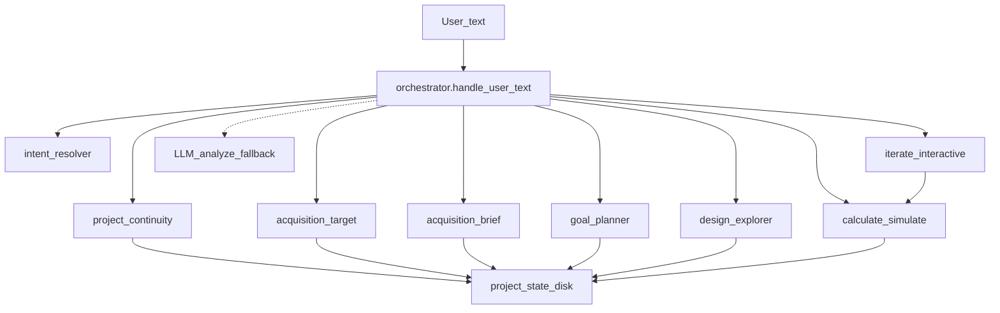
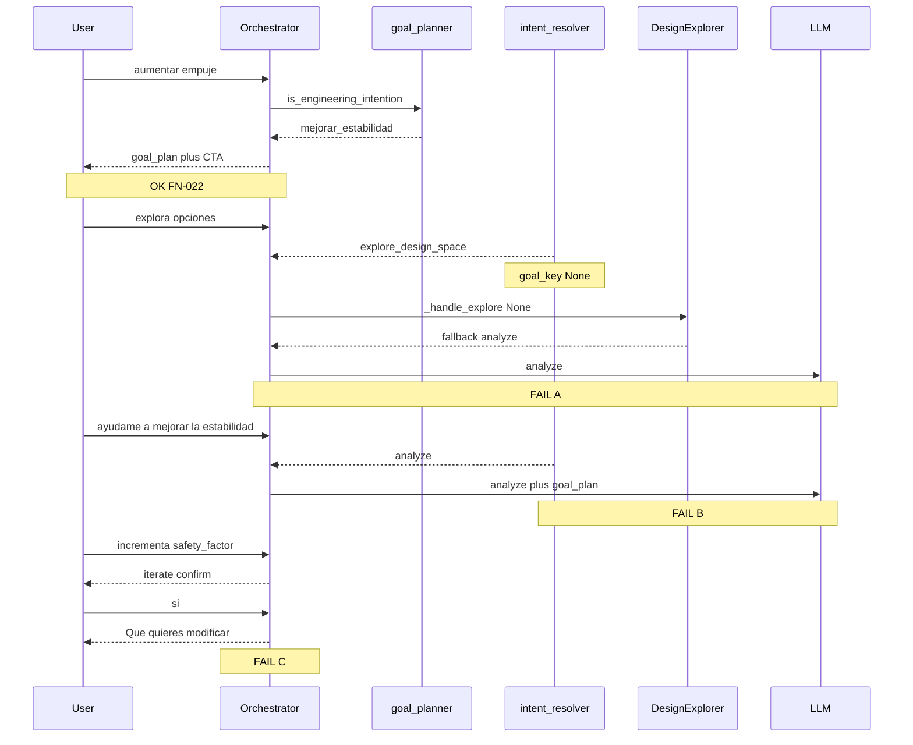

# Design — Layer Connection Map

**Date:** 2026-08-10  
**Status:** **CLOSED / SUPERSEDED** — design deliverable of this plan is complete. Living authority moved to **[`docs/system_map/`](../../docs/system_map/README.md)**. This file is **historical reference only**.

### Outcome (2026-08-12) — plan todos closed

| Plan deliverable | Result |
|---|---|
| This artifact (maps + failures A–E + H1–H5) | Written; absorbed into System Map `C-025/C-042/C-043/C-044/C-081` + `MISMATCHES.md` |
| Queue: handoffs before Create→BOM | Done — FN-024→026 shipped; Create→BOM still deferred (now after Physical Catalog v1) |
| FN-024 scope (H1+H2) | Full contract + delivery — see `.jes/artifacts/implementation_contract_fn024_h1_h2_handoff_dse.md` · report/review · tag `checkpoint-fn026-h4` |

| Failure / contract | Status |
|---|---|
| **A** / H1+H2 (Plan→DSE) | ✅ FN-024 — C-042 |
| **B** / H3 (help+goal) | ✅ FN-025 — C-025/C-044 |
| **C** / H4 (lever→iterate) | ✅ FN-026 — C-043 |
| **D** / H5 (Continuity risk thread) | 🟡 C-081 — design-only, deferred |
| **E** (plan-first vs auto-DSE) | Residual — not blocking |

Checkpoint: **`v0.2.0`** / **`checkpoint-fn026-h4`**. Next product frontier: Physical Component Catalog v1 (not more handoff FNs).

**Engineer note (2026-08-10, historical):** Do not implement H1–H5 from this file alone — Handoff Context lifecycle was designed first (`HANDOFF_CONTEXT_DESIGN.md` §5 CLOSED). That sequence was followed.

---

**Original purpose (historical):**

Map how deterministic layers connect after Acquisition Fluency, locate broken handoffs from the post-architecture CLI probe, and define normative handoff contracts **before** Create→BOM.

Acquisition Target Authority (FN-014…016) solved *what gap to acquire*.  
This map covers *what happens after architecture is complete* when the user states goals, explores, and mutates levers.

---

## 2. Master layer map



### Authority table

| Question | Authority | Must not decide |
|---|---|---|
| What is missing to define? | Acquisition Target + Continuity | LLM |
| What is the next useful step? | Continuity `next_useful_step` | LLM |
| What design goal? | `goal_planner` (`detect_goal` / `is_engineering_intention`) | LLM |
| Which configs to try? | DSE (`explore_design_space` + `goal_key`) | LLM |
| Mutate a concrete parameter? | Iterate / define_params (with value) | LLM inventing the variable |
| Narrate in language? | LLM | Choosing gap or goal |

---

## 3. Post-architecture path (CLI probe)



---

## 4. Failure table (evidence-backed)

| ID | Handoff | Symptom | Exact break | Modules |
|---|---|---|---|---|
| **A** | `goal_plan` → DSE | CTA offers `explora opciones`; user gets vague LLM | Intent=explore but `resolve_explore_goal`=None → `_handle_explore` falls to analyze | `_handle_engineering_intent` CTA; `resolve_explore_goal`; `_handle_explore` |
| **B** | help + goal → plan/DSE | `ayudame a mejorar la estabilidad` → analyze | Bare `\bayudame\b` wins (FN-023 only covered next-step help) | `intent_resolver` GUIDANCE vs ANALYZE |
| **C** | plan lever → iterate | After confirming `safety_factor`, wizard asks “qué modificar” | Named lever not preseeded into iterate | iterate session / semantic preseed |
| **D** | Continuity post-op | After simulate, next still “optimiza o simula” | Next step ignores active margin/goal thread | `project_continuity` |
| **E** | Two doors | `mejorar estabilidad`=auto-DSE; `aumentar empuje`=plan | Documented residual; do not block A–C | `.jes/artifacts/residual_engineering_intent_plan_vs_explore.md` |

**Create→BOM does not appear here.** Correctly deferred.

---

## 5. Normative handoff contracts (H1–H5)

### H1 — Plan → Explore (session goal)
If the previous successful turn was `engineering_intent` with `goal_key`, an explore phrase **without** an explicit domain (`explora opciones`) MUST use that session `goal_key` (minimal runtime field, e.g. `last_engineering_goal`). MUST NOT fall through to analyze solely because `resolve_explore_goal` is None when session goal exists.

### H2 — CTA honesty
CTAs from `_handle_engineering_intent` MUST only advertise phrases that either (a) resolve to DSE **with** a goal, or (b) are covered by H1. Prefer advertising `optimiza para {domain}` as primary; short `explora opciones` only if H1 is implemented.

### H3 — Help + goal
`ayúdame` + detectable design goal → `engineering_intent` or coherent explore — **not** bare analyze. Generic (all goals), same spirit as FN-023.

### H4 — Lever → mutate
If the user names a strategy lever from the plan (`safety_factor`, `per_motor_max_thrust_n` / motors, …) with a change verb, iterate MUST preseed that variable. MUST NOT reset to “¿Qué quieres modificar?” after an affirmative that already confirmed that lever.

### H5 — Continuity after sim (PASS risky)
With architecture complete and PASS+risky/low_margin, `next_useful_step` SHOULD point at the relevant lever/goal thread (margin/thrust), not only “simula otra vez”.

**Forbidden across H1–H5:** Conversation Engine; Step D; inventing parallel recommenders; Create→BOM.

---

## 6. Proposed implementation order (after Engineer approves this map)

| Cut | Contracts | Focus |
|---|---|---|
| **FN-024** | H1 + H2 | Plan→DSE handoff + honest CTA (highest CLI pain) |
| **FN-025** | H3 | `ayúdame` + goal → plan/explore |
| **FN-026** | H4 | Lever name → iterate preseed |
| **FN-027** | H5 | Continuity next after PASS risky (if still needed) |
| Later | — | Create→BOM handoff |
| Deferred | E | plan-first vs auto-DSE unification |
| Blocked | — | Step D / Conversation Engine |

---

## 7. FN-024 scope sketch (not a full Implementation Contract yet)

**Intent:** After `engineering_intent` for `mejorar_estabilidad`, `explora opciones` runs DSE for that goal — 0 LLM.

**Likely touch:**
- Persist `last_engineering_goal` (or reuse existing session slot) on `engineering_intent` success
- `_handle_explore`: if `goal_key is None` and session has last engineering goal → use it; only then consider clarify/analyze
- CTA text: primary example `optimiza para {domain}`; keep short explore phrase only with H1

**Out:** H3/H4/H5; Create→BOM; changing EXPLORE_PATTERNS globally for plan-first unification.

**Acceptance probe (CLI replay):**
```text
aumentar empuje → engineering_intent
explora opciones → explore_design_space / mejorar_estabilidad (not analyze)
optimiza para estabilidad → still DSE (regression)
```

Full Implementation Contract FN-024 is emitted only after Engineer approves this map.

---

## 8. Acquisition Fluency closure note

Plan *Acquisition Intent (unir Continuity ↔ adquisición)* Cortes 1–3 are **done**:

| Corte | FN | Status |
|---|---|---|
| 1 | FN-014 | Closed |
| 2 | FN-015 | Closed |
| 3 | FN-016 | Closed (contract + PASS WITH NOTES) |
| 4 | Copy | Deferred unless painful |

This design map is the **next** architectural thread (post-arch handoffs), not a reopening of Acquisition Fluency.

---

## 9. Success criterion before Create→BOM

```text
aumentar empuje → plan
explora opciones → DSE(mejorar_estabilidad)
aplica la mejor | incrementa safety_factor → coherent mutation
Continuity next reflects margin/thrust thread
```

**Partial close (2026-08-12):** lines 1–3 green via FN-024…026 (CLI field-proven). Line 4 (Continuity risk thread) remains **H5 / C-081** — deliberately open. Create→BOM stays deferred behind Physical Catalog v1, not behind more handoff FNs.
