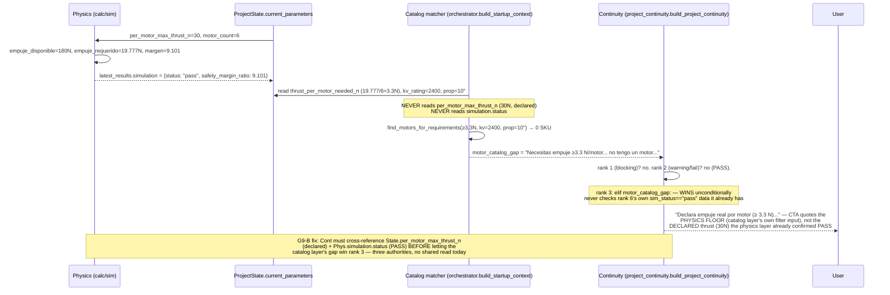

# Investigation — CLI Polish Audit

**Type:** Investigation / Audit only. Zero `src/` changes.  
**Status:** **CLOSED** — implemented as S1–S7; CLI re-walk PASS WITH NOTES; tag **`checkpoint-continuity-polish`**.  
**Contract:** [implementation_contract_cli_polish_audit.md](implementation_contract_cli_polish_audit.md)  
**Work plan:** [work_plan_cli_polish_audit.md](work_plan_cli_polish_audit.md)  
**Implementation IC:** [implementation_contract_cli_polish.md](implementation_contract_cli_polish.md)  
**Base commit:** `1b4769f` (Continuity Hardening + G10 materials/frame)  
**Delivered:** `15aa503`

---

## 4.1 Executive summary

**Verdict: ready for Implementation Contract for 6 of 8 findings; 1 needs a design decision (G9-B's exact suppression threshold); 1 (G13) could not be reproduced against current code and should be re-verified on the CLI before scoping any fix.**

None of the eight findings requires a new architectural subsystem, a Decision Engine, or a library JSON change. Every root cause is a bounded, local gap in an existing function — the same "local candidate set, not the actual active target/context" shape that Continuity Hardening's G14/G12/G8/G11 already fixed once. G16-A, G17, and part of G19 are literally the same fix pattern already proven twice (FN-019 propellers, G10 ★3/★8): a missing force-* gate or a missing list-* intent that mirrors an existing one. G9-B is a ranking/suppression bug in a pure function (`project_continuity.build_project_continuity`) with a precise, numeric reproduction. G18 is a missing domain guard on one regex branch. G12/FN-013 is a session-hygiene bug in the same family as the FN-021 lesson (`MISMATCHES.md`) — trust the freshly-computed block, not the stale session field. G13 could not be reproduced live against the current tree (see §4.2, G13) — the most likely explanation is that G10 ★2's alias-table unification already fixed it as a side effect, but this needs a CLI re-check, not a code assumption, before Engineer decides whether S8 is even needed.

**Recommended slice count and order: 8 slices, 3 fully independent + 5 with explicit dependencies** — see §4.4. Recommended order: **S1 (G9-B) → S2 (G16-A/G19 list-motors) → S3 (G18) → S4 (G17) → S5 (G12/FN-013) → S6 (G16-B) → S7 (G19 CTA bridge) → S8 (G13, defer pending re-verification)**. S1–S6 have no cross-dependencies among themselves and could ship in any relative order or even in parallel PRs; S7 depends on S1 and S2 landing first (it references both the fixed CTA and the new list-motors intent in its own text); S8 is gated on a CLI re-check, not on any other slice.

**Estimated risk per slice:** S2, S4, S6 are **low** (proven-pattern mirrors of already-shipped code). S1, S3 are **low-medium** (pure-function ranking change / one new domain guard, both narrowly testable). S5, S7 are **medium** (S5 touches a session-state trust boundary — the exact class of bug FN-021 closed once already; S7 is the largest, cross-cutting scope: Continuity + reasoning_layer + the new list-motors surface from S2). S8 is **unknown** pending re-verification — possibly zero remaining work.

---

## 4.2 Per-finding analysis

### G9-B — Misleading catalog-gap CTA when physics PASS with declared thrust covering requirement

**Symptom (CLI transcript, `continuity-bom`, 2026-08-17):**
```text
Cálculos: empuje_requerido=19.777 N, empuje_disponible=180.0 N, margen=9.101
Sim: PASS

Continuity:
  Siguiente paso: Declara empuje real por motor (≥ 3.3 N) …
  Por qué: Necesitas empuje ≥ 3.3 N/motor, ~2400KV, hélice ~10"; no tengo un motor…
```

**Code path:**
- `orchestrator.py:2960-3007` (`build_startup_context`'s catalog block) computes `catalog_gap` purely from `physical_requirements["thrust_per_motor_needed_n"]` (the physics **floor**, here `19.777 / 6 ≈ 3.3` N — `motor_count=6` from the DSE apply) plus the bound motor's `kv_rating` (2400) and `propeller_diameter_in` (10) via `default_library.find_motors_for_requirements(min_thrust_n=thrust_per, kv=kv_hint, prop_inch=prop_inch)`. It never reads `current_parameters["per_motor_max_thrust_n"]` (the **declared** value, 30 N here) or `latest_results["simulation"]["status"]`/`safety_margin_ratio`.
- `project_continuity.py:133-144` — `elif motor_catalog_gap:` is the **3rd**-ranked branch of `next_useful_step`'s if/elif chain, checked immediately after "blocking" and "warning/fail" and **before** the `elif sim_status == "pass":` fallback at line 188. Whenever `catalog_gap` is a non-empty string (true here — 2400 KV + 10" has no library SKU, regardless of thrust), this branch wins unconditionally: `next_step = f"Declara empuje real por motor (≥ {thrust:.1f} N) ..."` using `req.get("thrust_per_motor_needed_n")` — the **physics floor** (3.3 N) — never the **declared** `per_motor_max_thrust_n` (30 N) that the user already set via DSE apply.

**Root cause (one sentence):** `build_project_continuity`'s catalog-gap branch outranks the PASS fallback and phrases its CTA using the physics floor instead of the declared thrust, so a genuine **BOM/catalog identity gap** (no SKU exists for 2400 KV + 10") is worded as if it were a **physical viability gap** ("you haven't declared enough thrust") — even though the user declared 9× the floor and the simulation passed.

**Why current Continuity/G10/Continuity-Hardening didn't fix it:** G10 fixed **material** identity (frame acquisition), not motor catalog matching. Continuity Hardening's four slices fixed **routing/authority** bugs (which wizard owns a turn) — this is a **content/ranking** bug inside a pure function neither cut touched. G9 (the parent finding, catalog-gap blind to `catalog_ref`) was explicitly deferred pending catalog architecture clarity (Engineer lock, `cli_findings...md`); G9-B is the sharper, PASS-specific manifestation that G9's original scope didn't isolate.

**Proposed fix (behavior, not code):** In `build_project_continuity`, before letting `motor_catalog_gap` win the ranking, check whether `sim_status == "pass"` **and** the declared `per_motor_max_thrust_n` (read from `project_state.current_parameters`, already passed into this function) is `>= thrust_per_motor_needed_n`. If both hold, demote the catalog gap: keep it in `evidence` (unchanged — it's honest, useful BOM information) but do **not** let it win `next_useful_step`; fall through to the PASS branch, with its text extended to mention the BOM identity note non-alarmingly (see §4.5 for exact proposed copy).

**Blast radius / regression risk:** `project_continuity.py` (pure function, one new guard condition) + the caller in `orchestrator.py` (must ensure `per_motor_max_thrust_n` is threaded through — it's already in `project_state.current_parameters`, already passed as `project_state` itself, so no new parameter is needed). **Risk:** must not suppress catalog_gap when thrust is genuinely under-declared or undeclared — the guard is a `>=` comparison, not a blanket suppression whenever `sim_status=="pass"` (a PASS with an under-declared-but-technically-passing thrust should still show the gap). Existing `test_project_continuity.py` fixtures must be audited for any fixture that currently asserts `motor_catalog_gap` wins with `sim_status=="pass"` and adjusted if the declared thrust in that fixture also covers the requirement (if such a fixture exists, it was arguably already testing the bug, not the intended behavior).

**Test probes:**
- Unit: `build_project_continuity` with `sim_status="pass"`, `motor_catalog_gap` set, `current_parameters["per_motor_max_thrust_n"]=30`, `physical_requirements["thrust_per_motor_needed_n"]=3.3` → `next_useful_step` must **not** contain "Declara empuje"; must reflect PASS.
- Unit: same but `per_motor_max_thrust_n=2.0` (under floor) → catalog_gap **must** still win (regression guard against over-suppression).
- CLI: reproduce the exact `continuity-bom` DSE-apply sequence (declare thrust plan → `explora opciones` → `aplica la mejor` → `simula`) → `project_status` must not show the misleading CTA.

**Defer?** No — Tier-1, user-confusing, cheap fix (one pure function, no new subsystem).

---

### G9-A — Catalog-gap blind to bound `catalog_ref`

**Symptom:** A motor bound via `catalog_ref` (e.g. `sunnysky_r2305_2500`, untouched) still produces "no tengo un motor en el catálogo que cubra ese espacio" once physical requirements grow past that SKU's coverage — even though a specific, valid SKU is already bound.

**Code path:** Same block as G9-B, `orchestrator.py:2960-3007`. Confirmed **still unchanged** post-Continuity-Hardening (that cut never touched this block — verified by re-reading the current source; the only `catalog_ref`-aware code in `orchestrator.py` remains the G5 invalidation call in `_handle_engineering_intent`, an unrelated path). `build_project_continuity` receives no `catalog_ref` parameter at all.

**Root cause:** `catalog_matches`/`catalog_gap` are recomputed from scratch every call from `thrust_per_motor_needed_n`/`kv_rating`/`propeller_diameter_in` — never from the already-bound `catalog_ref`.

**Why not fixed yet:** Explicitly deferred by Engineer lock (`cli_findings...md` G9 section: "Do not fix G9 Continuity in isolation before catalog architecture (G10 → Impl C)"). Still the right call — see relationship to G9-B below.

**Relationship to G9-B:** G9-A and G9-B share the **same code block** (the catalog-gap computation) but are **different bugs** with **different fixes**: G9-B is a **ranking/wording** bug (the gap, once computed, is over-weighted and mis-worded against a PASS+covered state) — fixable without ever reading `catalog_ref`. G9-A is a **data-source** bug (the gap computation itself ignores an already-bound identity) — fixing it requires deciding a data contract ("bound-but-underspec'd SKU → gap, warning, or silence?", per the original G9 finding) that the polish bundle's own quality gate G4 forbids inventing without a separate design pass. **G9-B's fix does not require G9-A's fix** — the declared-thrust-covers-requirement guard (G9-B) is orthogonal to whether the gap computation itself reads `catalog_ref` (G9-A). Recommend: ship G9-B now (S1); leave G9-A deferred exactly as previously locked, to be revisited only alongside catalog architecture / Impl C.

**Proposed fix:** None in this bundle — restate the existing defer.

**Blast radius:** N/A (no fix in this bundle).

**Test probes:** N/A.

**Defer? Yes** — per existing Engineer lock, unchanged by this audit. G9-B does not require reopening it.

---

### G16-A — `list-motors` bypassed by analyze (trailing `?` and IDLE)

**Symptom:**
```text
# Mid-wizard (thrust DEFINE_MISSING)
User > que motores tenemos en el catalogo?   → intent=analyze → LLM   ❌
User > que motores tenemos en el catalogo    → list-motors deterministic ✅

# Post-architecture IDLE
User > ¿que motores tenemos en el catalogo?
→ analyze → LLM describes declared motors, NOT catalog list           ❌
```

**Code path (two independent layers, both verified live):**
1. **Wizard layer:** `intent_resolver.py:582` — `_looks_like_question`: `if "?" in normalized: return True`. `resolve_intent` checks `_looks_like_status_query` then `_looks_like_question` — the bare `?` alone forces `"analyze"` regardless of content. `orchestrator.py`'s `DEFINE_MISSING_PARAMETERS` branch (`:766-777`) checks `_dm_intent == "project_status"` then `_dm_intent == "list_materials"` (G10 ★8) as dedicated soft-interrupts **before** ever reaching `param_definition_session.answer()` — there is **no** equivalent `list_motors` check at this level. `is_list_motors_phrase` (added in Continuity Hardening Slice 3) only lives inside `ParamDefinitionSession._answer_assisted_motor`, reached only when `_dm_intent` is none of the special-cased values. With the trailing `?`, `_dm_intent == "analyze"` wins first (checked at `:788` area, `if _dm_intent == "analyze" and not is_help_choose_phrase(user_input): ... _handle_analyze`) and `_answer_assisted_motor` (and therefore `is_list_motors_phrase`) is never reached. Verified live: `resolve_intent("que motores tenemos en el catalogo?") == "analyze"` while `is_list_motors_phrase(...)` is `True` on the same string.
2. **IDLE layer:** `intent_resolver.py` has `LIST_MATERIALS_PATTERNS` (G10 ★8) feeding a dedicated `IntentType` value `"list_materials"` and an orchestrator handler `_handle_list_materials`. **No equivalent exists for motors** — no `LIST_MOTORS_PATTERNS`, no `"list_motors"` IntentType member, no `_handle_list_motors`. Without a `?`, `"que motores tenemos en el catalogo"` doesn't match `DOMAIN_HINT_PATTERNS` (no "motor" keyword there) either, so `resolve_intent` returns `"unknown"` at IDLE — falls all the way to the bounded LLM `interpret()` fallback (closed 4-action set), not a deterministic list. With a `?`, it resolves to `"analyze"` and the LLM narrates instead.

**Root cause:** G10 ★8 built the materials list-intent as a **complete vertical slice** (IDLE intent + orchestrator handler + wizard soft-interrupt); the equivalent motors vertical was only ever built **half-way** (Continuity Hardening Slice 3 added `is_list_motors_phrase` and wired it into the wizard's own `answer()` — but not the two upstream layers that must let a phrase reach that point at all).

**Why current Continuity/G10 didn't fix it:** Continuity Hardening's Slice 3 (★5) was explicitly scoped to "inside `ParamDefinitionSession.answer`" per its own Implementation Contract — the orchestrator-level soft-interrupt and the IDLE-level global intent were out of that slice's stated scope, not an oversight discovered only now.

**Proposed fix:** Two additive layers, both direct mirrors of shipped code:
1. Add `LIST_MOTORS_PATTERNS` + `"list_motors"` IntentType + `_handle_list_motors()` in `intent_resolver.py`/`orchestrator.py`, same shape as `LIST_MATERIALS_PATTERNS`/`_handle_list_materials` — filtered by live project's `thrust_per_motor_needed_n`/`kv_rating`/`propeller_diameter_in` when a project is active (reuse `motor_catalog_assist.build_motor_catalog_suggestions`/`derive_kv_prop_filters`, already extracted in Continuity Hardening ★6), falling back to an unfiltered `list_motors()` dump otherwise.
2. Add a `_dm_intent == "list_motors"` soft-interrupt in the `DEFINE_MISSING_PARAMETERS` branch, positioned exactly like the existing `list_materials` check (before the `analyze` branch) — this alone also fixes the trailing-`?` wizard case, since the new dedicated intent wins before `_looks_like_question`'s bare-`?` catch-all gets a chance (intent classification order already puts `LIST_MOTORS_PATTERNS` ahead of `ANALYZE`/question fallback, mirroring how `LIST_MATERIALS_PATTERNS` is checked first in `_resolve_strong_action_intent`).

**Blast radius:** `intent_resolver.py` (new patterns + IntentType member, additive), `orchestrator.py` (new handler + 1-2 new soft-interrupt checks, additive, same locations as the `list_materials` ones), possibly `motor_catalog_assist.py` (a thin `_handle_list_motors`-facing formatter if the existing `format_motor_catalog_suggestions` needs a no-project variant). **Regression risk: low** — same pattern shipped twice already (G10 ★8, Continuity Hardening's list_materials soft-interrupts), proven not to collide with existing `"material"`/iterate-variable routing; the motors equivalent needs the same narrow-pattern discipline (don't steal `"motor"` mentions inside real component descriptions).

**Test probes:**
- Unit: `resolve_intent("que motores tenemos en el catalogo?") == "list_motors"`, `resolve_intent("¿qué motores hay?") == "list_motors"`.
- Unit: IDLE `handle_user_text` with a `_FakeLLM` that raises → list-motors phrase (with and without `?`) returns deterministic content, LLM never called.
- CLI: probe #1 and #3 in the work plan's §8 acceptance table.

**Defer?** No — Tier-1, cheap, proven-pattern mirror.

---

### G16-B — "Elige un número…" printed twice

**Symptom:**
```text
User > que motores tenemos en el catalogo
Jarvis > Candidatos del catálogo …
         Elige un número, indica empuje en N … o di 'no' para omitir.
Siguiente paso:
         Elige un número, indica empuje en N … o di 'no' para omitir.
```

**Code path:** `motor_catalog_assist.py:267-289` (`format_motor_catalog_suggestions`) appends its own CTA line into the returned string when `param="per_motor_max_thrust_n"` (`:285`) or the default W-copy (`:289`) — this becomes the response's `message`. `param_definition_session.py:307-343` (`_offer_catalog_help`) independently builds a near-identical `question` string (`:339` for the thrust param, `:343` for the default). The CLI renderer prints `message` then `"Siguiente paso: " + question` — two independently-authored, nearly-identical sentences, both shown.

**Root cause:** Two separate string-builders (`format_motor_catalog_suggestions`'s trailing line and `_offer_catalog_help`'s `question`) encode the same "how to answer" instruction with no single source of truth.

**Why not fixed yet:** Genuinely new — introduced by Continuity Hardening's own G15/★5/★6 work (the `message`/`question` split predates it, but the CLI-visible duplication was only characterized as its own finding, G16-B, during the `continuity-bom` walk after Slice 3 landed).

**Proposed fix:** Pick one owner. Simplest: strip the trailing "Elige un número..." line from `format_motor_catalog_suggestions`'s output when it's about to be used as a `message` alongside a separately-built `question` (i.e., have `_offer_catalog_help` pass a flag or use a `message`-only variant of the formatter), and keep the CTA only in `question` — the single line the CLI renderer's "Siguiente paso:" prefix already frames as the instruction.

**Blast radius:** `motor_catalog_assist.py` (formatter gains a parameter or a `message`-only variant) + `param_definition_session.py` (caller passes the new flag/variant). **Regression risk: low** — pure string composition, no routing/state change. Must check other callers of `format_motor_catalog_suggestions` (e.g. `iterate_interactive_session.py`'s motor-suggestion path, which has its own separate question-building) don't need the trailing line removed too or develop the same duplication independently — worth a grep-and-check during implementation, not a redesign.

**Test probes:**
- Unit: `_offer_catalog_help`'s returned `message` does not contain the "Elige un número" substring; `question` does.
- CLI: probe from work plan §8 (implicit in probe #1 — visually confirm no duplicate line).

**Defer?** No — Tier-2 but trivial; bundle with S2 (G16-A) since they touch the same call site and CLI evidence together.

---

### G17 — No force-motors (motors wizard example phrases don't bind)

**Symptom:**
```text
Motors wizard open (expected_keys=["motors","propellers"])
User > 1x 2306 2400KV 50W   → re-prompt motors brief (no write)   ❌
User > 4x 2306 2400KV 50W   → same re-prompt                      ❌
User > motores 4x 2306 2400KV 50W → Motores registrados…          ✅
```

**Code path:** `aerial.py:441` — the motors `ComponentRule`'s only keyword is `"motor"` (no `"motors"`/`"motores"` variant needed since it's a substring match, but the phrase must literally contain that substring). `1x 2306 2400KV 50W` contains no such substring → `infer_components` → `generic_component`. `orchestrator.py`'s `_handle_component_description` has a force-propellers block (FN-019, gated by Continuity Hardening ★4) and a force-frame block (G10 ★3) — **no force-motors block exists**. Verified live: `infer_component_for_key("1x 2306 2400KV 50W", "motors", registry=aerial_registry).completeness == "high"` with correctly extracted `motor_count=1`, `kv_rating=2400.0`, `power_w=50.0` — **the extractor works perfectly; the orchestrator simply never calls it for this key.**

**Root cause:** The force-* mechanism (FN-019 → G10 ★3 → Continuity Hardening ★4) was extended twice (propellers, frame) but never for `motors` itself — the one key that is the propulsion block's own first-declared, most commonly typed target.

**Why current Continuity Hardening didn't fix it:** Continuity Hardening's Slice 1 (★4) explicitly *gated* force-propellers so it wouldn't fire on motor-shaped text — closing G14 (wrong write) — but the contract's Slice 1 scope never included *adding* a force-motors branch, only gating the existing force-propellers one. G17 is the gap G14's fix exposed by removing the false-positive path, not a regression of G14 (explicitly noted in the finding's own text and confirmed by this audit: G14's fix and G17's gap are the same code region but distinct, non-overlapping behaviors — G14 stops a wrong write, G17 is a missing correct write).

**Proposed fix:** Add a force-motors block in `_handle_component_description`, same shape as force-propellers/force-frame: when `"motors" in expected_keys` and all specs are `generic_component`, call `infer_component_for_key(user_input, "motors", registry=aerial_registry)`; if completeness `!= "low"`, use it. Given Continuity Hardening ★4 already established "don't force propellers on motor-shaped text while motors is pending, prefer motors," force-motors should simply run **first** (or the propellers gate's existing `"motors" not in expected_keys or _looks_clearly_propeller_shaped(...)` condition naturally yields to a successful force-motors match if force-motors is tried first in the same `if/elif` chain) — no new tiebreak logic needed beyond ordering.

**Blast radius:** `orchestrator.py` only (`_handle_component_description`, new block mirroring the existing two). **Regression risk: low** — same proven pattern, third instance. Must verify ordering against the existing force-propellers gate doesn't reintroduce G14 (a mixed phrase that's ambiguous between motors/propellers should still prefer motors, which is what both G14's fix and this new block agree on).

**Test probes:**
- Unit: composite `expected_keys=["motors","propellers"]` + `"1x 2306 2400KV 50W"` / `"4x 2306 2400KV 50W"` → writes to `motors`, not a re-prompt.
- Unit: singleton `expected_keys=["motors"]` + bare `"4x 2306 2400KV 50W"` → still forces (this is currently untested — worth adding regardless of the composite case).
- Regression: existing `test_continuity_hardening.py` T1-T3 (G14 gate) must stay green — force-motors must not resurrect force-propellers' false positive.

**Defer?** No — Tier-1, cheap, proven pattern, blocks a clean BOM walk exactly like G14 did.

---

### G18 — `definir motores` on aerial project opens terrestrial transmission wizard

**Symptom:**
```text
Project: dron (vehicle_type=dron), architecture 4/4, motors component already declared
User > definir motores
→ "¿Cuál es el par de torsión por actuador en N*m?"
User > 1.4
→ "¿Cuál es el radio de rueda en metros?"
```
Session snapshot: `param_definition_reason=missing_transmission_parameters`, `pending=["wheel_radius_m","gear_ratio"]`.

**Code path:** `intent_resolver.py`'s `DEFINE_PARAMS_PATTERNS` (E1) has an aerial branch (bateria/energía/hélices) and a terrestrial branch: `r"\b(?:definir?|configurar|declarar|especificar)\b.*\b(?:motor(?:es)?|transmisi[oó]n|torque|rueda[s]?|tracci[oó]n)\b"`. **"motor(es)" only appears in the terrestrial branch** — there is no aerial-side pattern for bare "motor(es)" at all (aerial's own DEFINE_PARAMS branches only cover bateria/energía/hélices explicitly). `IntentResolver.resolve_action_request` is a pure function of `user_input` (and an optional pre-resolved `intent`) — it has **no `vehicle_type` parameter and no access to `ProjectState`** by construction (`IntentResolver` is stateless, verified: zero I/O, zero project-state reads anywhere in the class). Verified live: `resolve_action_request("definir motores")` returns `{"action": "define_missing_parameters", "parameters": {"reason": "missing_transmission_parameters"}}` unconditionally, regardless of any project context — because none is ever passed in.

**Root cause:** The terrestrial "motor(es)" pattern has no domain gate, and no aerial-side pattern exists to win first — so on a purely aerial project, "definir motores" always matches the terrestrial branch, because `IntentResolver` is architecturally blind to `vehicle_type`.

**Why current Continuity/G10/Continuity-Hardening didn't fix it:** E1 (the terrestrial parameter set) is unrelated work that predates this polish bundle; none of G10 or Continuity Hardening touched `DEFINE_PARAMS_PATTERNS` at all.

**Proposed fix:** Two viable shapes (Engineer/design-time choice, not resolved by this audit — see §4.7):
- **(a) Orchestrator-side gate:** before calling `resolve_action_request`, the orchestrator (which *does* have `project_state.current_parameters["vehicle_type"]`) checks: if `intent == "define_params"` and the phrase would resolve to `missing_transmission_parameters` and the active project's vehicle type is aerial (`dron`/`uav`/etc., via the existing `VEHICLE_TYPE_ALIASES`), redirect instead to the acquisition path for `motors` (mirroring how `definir bateria`/`definir helices` already reach acquisition via `missing_energy_parameters`/`missing_propeller_parameters`) or to a `_try_start_acquisition_from_mention`-style component wizard open, rather than dispatching the terrestrial reason.
- **(b) Intent-resolver-side signature change:** thread `vehicle_type` (a plain string, not a `ProjectState`) into `resolve_action_request`/`resolve_intent`, gate the terrestrial "motor(es)" match on `vehicle_type not in AERIAL_TYPES`. Larger surface (changes a widely-called pure function's signature) but keeps the domain logic in one place instead of splitting it across two modules.

This audit recommends **(a)** as the smaller, safer blast radius (the `IntentResolver` stays a pure, stateless text classifier — consistent with its documented design, `02_intent/INTENT_MAP.md`: "the entire subsystem is this one class... stateless"), but flags this as needing Engineer confirmation, not a unilateral pick.

**Blast radius:** (a) `orchestrator.py` only, new pre-dispatch check. (b) `intent_resolver.py` (signature change) + every caller of `resolve_action_request`/`resolve_intent` that would need to start passing `vehicle_type` (multiple call sites in `orchestrator.py` — larger, riskier diff). **Regression risk: low for (a), medium for (b)** (signature changes to a heavily-called pure function risk missing a call site and silently keeping the old blind behavior somewhere).

**Test probes:**
- Unit: `definir motores` on a `dron` project → routes to aerial motors acquisition, not `missing_transmission_parameters`.
- Regression: `definir motores` on a `robot`/`rover`/terrestrial project → **must still** route to `missing_transmission_parameters` (this is E1's actual intended behavior for its real domain — do not break it).
- CLI: probe #3 in work plan §8.

**Defer?** No — Tier-1, cross-domain routing bug is a hard blocker for any aerial user who naturally says "definir motores" instead of "definir propulsion."

---

### G19 — Catalog-gap CTA: poor discoverability + no list/explore bridge

**Symptom (two phases):**
```text
# Phase 1 — apparent dead-end
Continuity: "Siguiente paso: Declara empuje real por motor (≥ 4.8 N) o elige pieza fuera de catálogo"
User > ¿que motores tenemos en el catalogo?  → analyze/LLM, denies catalog info      ❌ (G16-A)
User > modelar unidad de potencia            → analyze/LLM, "no puedo estimar..."    ❌

# Phase 2 — hidden path exists (2026-08-17 addendum)
User > declarar empuje    → engineering_intent → Plan estabilidad
User > explora opciones   → DSE 5 configs (mejor: 30N × 6 motores)                   ✅
User > aplica la mejor    → per_motor_max_thrust_n 20→30, motors 4→6                 ✅
→ sim PASS margen 9.1 — Continuity still asks "declara empuje ≥ 3.3 N" (G9-B)
```

**Code path (four layers, one table):**

| Layer | Behavior | Gap |
|---|---|---|
| `project_continuity.py` rank 3 | `motor_catalog_gap` CTA = "declare thrust or off-catalog part" | No branch offering "explore catalog" / "see closest matches" |
| `intent_resolver.py` | `LIST_MATERIALS_PATTERNS` → `list_materials` exists at IDLE | No `LIST_MOTORS_PATTERNS` equivalent (= G16-A) |
| `motor_catalog_assist.py` | `is_list_motors_phrase`, `offer_catalog_help`, filtered search all exist and work | Only reachable mid-wizard, and only without a trailing `?` (= G16-A) |
| `reasoning_layer.py:331-338` | Suggests `ReasoningSuggestion(action="iterate", label="Modelar unidad de potencia", ...)` | The suggestion carries a structured `action="iterate"` field, but **nothing maps the user typing the label text back** to that action — `resolve_intent("modelar unidad de potencia")` doesn't match any `ITERATE_PATTERNS` verb (`"modelar"` is not one of `reduce/mejora/optimiza/aumenta/define/cambia/...`), so it falls to `analyze`/LLM, an honest-but-unhelpful "no puedo estimar" response. Verified by direct code reading of both the suggestion builder and `ITERATE_PATTERNS`'s verb list — confirmed dead-end. |

**Root cause (one sentence):** The exploration path (`declarar empuje` → `explora opciones` → `aplica la mejor`) genuinely exists and works, but Continuity's own CTA never mentions it, list-motors is unreachable from where the CTA is shown (G16-A), and the reasoning layer's suggested actions are narrative-only, not re-enterable — so a user who trusts the CTA's literal wording has no way to discover the path that actually resolves their situation.

**Why current Continuity/G10 didn't fix it:** This is a **product-completeness** gap across three subsystems that individually work correctly (Continuity's ranking, the DSE flow, the reasoning suggestions) — none of the prior cuts (G10, Continuity Hardening) had "wire these three together" in scope; each shipped its own piece correctly in isolation.

**Proposed fix (behavior, not code):**
1. **G10 ★8 parity for motors** (= G16-A's fix, S2) — the load-bearing prerequisite; G19 cannot reference a working `list_motors` phrase in its own CTA text until S2 ships.
2. **Continuity CTA branch:** when `motor_catalog_gap` is active (post-G9-B's guard, i.e. it's a *genuine* gap, not a PASS+covered false alarm), append a discoverability line: *"Di 'qué motores tenemos' para ver el catálogo, o 'explora opciones' para que Jarvis pruebe configuraciones alternativas."* — reusing exactly the two phrases that already work (S2's new list-motors, and the pre-existing, already-working `explora opciones` DSE path) rather than inventing a third mechanism.
3. **Reasoning → action wiring:** for the two motor-related suggestions in `reasoning_layer.py` (`"Definir empuje por motor real"`, `"Modelar unidad de potencia"`), either (a) change their `label` text to a phrase that already resolves correctly (e.g. reference `list_motors` or the thrust wizard's own opening phrase), or (b) leave the label as user-facing narrative but ensure the *reasoning output's own re-display* (not free-text re-entry) offers a numbered/selectable path — this needs an Engineer decision on how much of "make suggestions executable" this bundle should absorb vs. defer to a broader reasoning/action-wiring redesign (see §4.7).

**Blast radius / regression risk:** `project_continuity.py` (new CTA branch text, additive), `reasoning_layer.py` (label text or a new "action hint" field — small if scoped to (a), larger if (b)). **Depends on S1 (G9-B) and S2 (G16-A)** — implementing G19's CTA bridge before either would either reference a non-existent `list_motors` phrase or fight with G9-B's own CTA-text changes in the same function.

**Test probes:**
- Unit: `build_project_continuity` with an active, unresolved `motor_catalog_gap` → `next_useful_step`/`evidence` mentions both "qué motores" and "explora opciones."
- CLI: probe #6 in work plan §8 ("catalog_gap active → CTA mentions explora opciones or list-motors").

**Defer?** No for the CTA-text bridge (cheap once S1+S2 exist). The reasoning-suggestion executability half ((b) above) may be worth deferring independently if Engineer judges it a larger redesign — flagged as an open question, not a blocker for the rest of S7.

---

### G12 / FN-013 — Stale `pending_param_definitions` vs freshly-computed `_next_pending_block`

**Symptom (Continuity Hardening post-impl addendum, `cli_findings...md`):**
```text
User > definir bateria
→ "Seguimos con Energía (batería) — sin reiniciar lo ya capturado."
→ brief body = motors ("Hélices ya declarado(s); gap activo = motors")
```

**Code path:** `orchestrator.py:1175-1226` (`_try_reprompt_active_block_declaration`, FN-013). Line 1183: `block_key = resolve_declare_block_request(user_input)` → e.g. `"energy"`. Line 1192: `pending_block = self._next_pending_block(project_state)` — a **fresh, correct** recomputation from `project_state`, e.g. `("energy", "pending")`. Line 1193: `if pending_block[0] != block_key: return None` — passes (they match: both `"energy"`), so the function proceeds. Line 1200: `label = self._block_label_for(project_state, block_key)` → uses the **fresh** `block_key` → correct label, `"Energía (batería)"`. **But** line 1195-1196: `session = self.state_manager.get_runtime_session(); pending = list(session.pending_param_definitions or [])` — reads the **runtime session's own stale field**, which can still hold `["motors"]` left over from the propulsion wizard if propulsion became "complete" through a path that never ran the wizard's own turn-by-turn `_set_pending_next_block` chaining (e.g. a DSE apply that filled `motors` directly via `component_sync`, bypassing the DEFINE_MISSING wizard entirely). Line 1202: `first = pending[0]` → `"motors"` (stale) → the brief built from `first` (`build_acquisition_brief("motors", ...)` or `_question_for_param("motors", ...)`) narrates the **wrong** component, while the message's `label` line correctly says "Energía (batería)."

**Root cause:** `_try_reprompt_active_block_declaration` proves the **block-level** label is fresh (comparing `resolve_declare_block_request`'s result against `_next_pending_block`'s fresh recomputation) but then trusts the **component-level** body (`session.pending_param_definitions[0]`) without the same freshness check — a session field that "means the last thing we were talking about" (exactly the class FN-021's own lesson in `MISMATCHES.md` warns about) was never proven to still be in sync with the block it's about to be presented under.

**Why Continuity Hardening's Slice 2 (★2 refuse policy) didn't catch it:** Slice 2's `_maybe_refuse_different_target` fires only when the named block **differs** from the active target (a G8/G12-shaped mismatch) — here, `block_key == pending_block[0]` (both `"energy"`), so this **is** recognized as "the same block, re-prompt in place" (correctly, per FN-013's own original design) and Slice 2's refuse check never triggers (it only guards the cross-block case). The bug is entirely **inside** the same-block reprompt path FN-013 already owned, pre-dating Continuity Hardening — Slice 2 closed a different gap (silent brief re-show for a *genuinely different* target) than this one (correct-looking label, stale body, for the *same* target).

**Proposed fix:** Before building `first`/`pending`, verify `pending[0]` (if any) actually belongs to `block_key`'s own component set (`system_architecture_catalog.BLOCK_TO_COMPONENTS[block_key]`). If it does not, don't trust `session.pending_param_definitions` — instead re-derive the correct pending components for `block_key` fresh (the same computation `_next_pending_block`/`start_define_missing_params` would use to open this block correctly from scratch), and use that fresh list to build the brief. This keeps FN-013's "don't restart, don't wipe `collected_params`" guarantee for the case that's actually still valid (same-component reprompt) while no longer trusting a demonstrably-stale field for the case it doesn't cover.

**Blast radius:** `orchestrator.py` (`_try_reprompt_active_block_declaration` only). **Regression risk: medium** — this is exactly the FN-021 bug shape (a "what were we just doing" field going stale); the fix must be proven against every path that can make propulsion/any block "complete" without the wizard's own chaining running (DSE apply via `component_sync`, direct component-intercept writes via the global `C-013` intercept, `_apply_inferred_component_spec`) — per `MISMATCHES.md`'s own methodology ("enumerate every mutation/turn-boundary entry point first... require a clear-or-justify at each one").

**Test probes:**
- Unit: force a session with `pending_param_definitions=["motors"]` while `_next_pending_block` (via a project fixture with motors already complete) returns `("energy", ...)`; call `_try_reprompt_active_block_declaration("definir bateria")` → the returned body must reference battery, not motors.
- CLI: probe #5 in work plan §8 ("definir bateria after propulsion → battery wizard without stale motors body").
- Regression: existing FN-013 tests (same-block reprompt with a **fresh** session) must stay green.

**Defer? No** — Tier-2 but directly blocks the "no cancelar" BOM-walk acceptance criterion the whole polish bundle is measured against.

---

### G13 — Iterate material value: compound `PVC 400g` (could not reproduce on current code)

**Symptom (as originally filed, 2026-08-15, project `volar`):**
```text
Iterate material slot
User > PVC        → Cambio plástico → pvc: ρ 1200.0→1380.0 kg/m³, ...   ✅
User > PVC 400g   → "El material 'pvc 400g' ha sido registrado... pero no tengo datos físicos"  ❌
```

**Code path investigated:** Two entry points in `iterate_interactive_session.py` handle a material value: (1) line 294-320, the direct `_awaiting_material_value` question-answer step, calls `_extract_material_from_text(normalized)` before ever storing `draft.value`; (2) line 409-425, the "Gap 1" combined-strategy path, calls `_extract_material_from_text(updated_draft.strategy or "")` before storing `draft.value`. Both call sites use `_extract_material_from_text`, which does a substring search over `iterate_domain._KNOWN_MATERIALS` — **since G10 ★2, this table is `jarvis.domains.materials.MATERIAL_ALIASES`**, the same shared table the frame-acquisition path uses, which does contain `"pvc"` as a key. The failure message text ("ha sido registrado... pero no tengo datos físicos") is produced only by `_estimate_material_impact`'s `except KeyError` branch (`:685-694`), which is reached with whatever raw string `draft.value` already holds — **not** re-extracted at that point.

**Live reproduction attempted (this audit):** Both entry points were exercised directly against current code with `"PVC 400g"` as the answer — in both cases, `_extract_material_from_text("pvc 400g")` correctly returned `"pvc"`, `draft.value` was correctly set to `"pvc"` (not the raw compound string), and the subsequent impact estimate computed correctly (`aluminio → pvc: ρ 2700.0→1380.0, -12.2%`). **The originally-reported failure did not reproduce** in either of the two turn shapes this audit could identify as matching the transcript's "Iterate material slot" framing.

**Root cause:** Could not be conclusively determined against current code. The most likely explanation, consistent with everything else this audit found: **G10 ★2 (single shared `MATERIAL_ALIASES` table, replacing two independently-drifting alias dicts) already fixed this as a side effect** — G13 was filed against a pre-★2 code state where `iterate_domain._KNOWN_MATERIALS` may not have contained `"pvc"` at all (the original G13 hypothesis text itself says "lookup `pvc 400g` misses alias `pvc`" — consistent with a table that lacked the alias entirely, not merely a compound-parsing bug). A residual theoretical risk remains: `_estimate_impact`'s `material_value = (draft.value or "").strip().lower()` (the line feeding `_estimate_material_impact`) reads `draft.value` **as already stored**, without re-running extraction — so *if* some other, unaudited code path can set `draft.value` to a raw, unextracted compound string, the originally-reported failure mode would still be reachable. This audit did not find such a path in the two call sites it checked, but did not exhaustively trace every draft-mutation site in `iterate_interactive_session.py` (a ~1350-line module) within this audit's time budget.

**Why not fold into G10 / why not patch now:** Unchanged from the original finding's own reasoning — even if a residual gap exists, it would not be a G10 regression (G10's own acceptance tests, `test_g10_materials_frame.py`, all pass and don't cover this iterate-slot interaction).

**Proposed fix:** **Re-verify on a live CLI walk first** (a single probe: iterate material slot, direct answer `"PVC 400g"`), before writing any Implementation Contract slice for this. If it reproduces, the fix is narrow: make `_estimate_material_impact`'s `KeyError` branch attempt `_extract_material_from_text` on `new_material` before giving up (a one-line defensive re-extraction), rather than assuming every caller already normalized `draft.value`. If it does not reproduce, close G13 as "fixed by G10 ★2" with a regression test added to lock it.

**Blast radius (if still needed):** `iterate_interactive_session.py` only, one function, additive fallback. **Regression risk: low** (the fallback only activates inside an already-caught-exception branch, cannot make anything currently-working worse).

**Test probes:**
- CLI (required first step, not a unit test): the exact `"PVC"` then `"PVC 400g"` sequence from the original transcript, on current code.
- If it reproduces: unit test pinning `_estimate_material_impact`/`_extract_material_from_text` interaction for a compound value.
- If it does not reproduce: regression test locking `"PVC 400g"` → correct extraction + correct impact estimate (this audit's own successful probe, formalized).

**Defer? Yes, recommended** — pending the CLI re-verification above. Do not scope S8 as a code-change slice until that single probe result is known; it may require zero further work.

---

## 4.3 Authority diagram

How physics (calc/sim), catalog matcher, and Continuity CTA interact — the G9-B case:



**The core authority gap:** physics (what's physically true) and the catalog matcher (what SKU identity exists) are both individually honest and correct — physics says PASS with 9× margin; the catalog matcher correctly says "no SKU for 2400KV+10"." Continuity is the **only** layer positioned to reconcile them (it already reads both `sim_status`/`margin` and receives `project_state`, from which it could read `per_motor_max_thrust_n`) — but its ranking function currently treats the catalog matcher's output as if it were a physics-layer signal, letting a pure **identity/BOM** gap outrank a **physics** PASS.

---

## 4.4 Proposed implementation slices

| Slice | Findings | Files (estimate) | Tests | Depends on |
|---|---|---|---|---|
| **S1** | G9-B | `project_continuity.py`, `orchestrator.py` (thread declared thrust — likely already available via `project_state`, no new param) | 2 unit (suppress + regression-guard), 1 CLI | none |
| **S2** | G16-A, G16-B | `intent_resolver.py` (new `LIST_MOTORS_PATTERNS`/`"list_motors"`), `orchestrator.py` (new handler + 2 soft-interrupts), `motor_catalog_assist.py`, `param_definition_session.py` (dedupe CTA) | 4 unit, 2 CLI | none |
| **S3** | G18 | `orchestrator.py` (recommended: pre-dispatch vehicle_type gate) | 2 unit (aerial redirect + terrestrial regression), 1 CLI | none |
| **S4** | G17 | `orchestrator.py` (`_handle_component_description`, new force-motors block) | 3 unit (composite, singleton, G14 regression), 1 CLI | none (conceptually follows G14 but no code dependency) |
| **S5** | G12 / FN-013 | `orchestrator.py` (`_try_reprompt_active_block_declaration`) | 2 unit (stale-pending repro + fresh-session regression), 1 CLI | none |
| **S6** | (folded into S2 — see note) | — | — | S2 |
| **S7** | G19 (CTA bridge + reasoning wiring) | `project_continuity.py`, `reasoning_layer.py` | 1 unit, 1 CLI | **S1, S2** |
| **S8** | G13 | none yet — CLI re-verification first | 1 CLI probe (gate before any code) | none |

**Note on S6:** the work plan's pre-audit hypothesis listed G16-B as its own slice (S6); this audit found G16-A and G16-B share the same two files (`motor_catalog_assist.py`, `param_definition_session.py`) and the same CLI evidence turn — recommend folding G16-B into S2 rather than a separate slice, reducing the total from the hypothesized 8 to **7 code slices + 1 verification-gated slice (S8)**.

**Explicit non-goals per slice:**
- **S1:** does not read `catalog_ref` (that's G9-A, explicitly out of scope — see G9-A's own analysis). Does not touch `orchestrator.py`'s catalog-gap *computation* (only Continuity's *ranking* of the already-computed gap).
- **S2:** does not change `format_no_thrust_candidate_message`'s filtering (Continuity Hardening ★6, already correct). Does not add a DSE axis for motors (that's G19's optional #4, explicitly deferred).
- **S3:** does not change `DEFINE_PARAMS_PATTERNS`'s terrestrial behavior for actual terrestrial projects (regression-guarded). Does not touch G17's acquisition-side fix (different layer: G18 is intent routing before any wizard opens; G17 is force-binding inside an already-open wizard).
- **S4:** does not loosen the G14 propeller gate (Continuity Hardening ★4) — force-motors must coexist with, not replace, that gate.
- **S5:** does not implement retarget-(a) (Continuity Hardening ★2 already rejected it) — this is a **same-target** freshness fix, not a retarget-policy change.
- **S7:** does not implement DSE axis for motors (G19's optional #4). Does not redesign reasoning-suggestion executability beyond the two motor-specific labels, unless Engineer explicitly widens scope (§4.7).
- **S8:** no code change until the CLI re-verification probe runs.
- **All slices:** no G10 materials/keywords/mutation-SoT edits (regression guard, quality gate G4). No Conversation Engine, no Decision Engine, no library JSON edits, no Impl C.

---

## 4.5 Continuity CTA policy proposal

**When should `motor_catalog_gap` appear as `next_useful_step`?**
Only when it represents an **actionable** gap the user has not already resolved physically: i.e., when `sim_status != "pass"` **or** the declared `per_motor_max_thrust_n` is absent **or** `per_motor_max_thrust_n < thrust_per_motor_needed_n`. In every other case (PASS **and** declared thrust already covers the floor), the gap is a BOM/catalog **identity** note, not a physics blocker.

**When should it be suppressed or demoted to evidence-only?**
Demoted (not suppressed outright — the information is true and useful) whenever the condition above says "not actionable." It stays in `evidence` unconditionally (unchanged — `project_continuity.py:112-113` already puts it there regardless of rank outcome); only its right to **win** `next_useful_step` is gated.

**What CTA text when declared thrust >> required thrust and sim PASS?**
Fall through to (an extended version of) the existing PASS branch (`project_continuity.py:188-190`). Proposed text:
```text
next_step: "Diseño en PASS (margen {margin:.1f}×) — puedes iterar, explorar
            alternativas, o vincular una pieza real del catálogo."
next_why:  "No hay gaps físicos bloqueantes. Nota de catálogo: {motor_catalog_gap}
            — di 'qué motores tenemos' para ver el catálogo, o 'explora opciones'
            para que Jarvis pruebe configuraciones que sí tengan SKU."
```
This keeps the honest BOM/identity fact (in `next_why`, not hidden) while making unmistakably clear the design is **not** blocked, and gives the two working escape hatches by name.

**How to connect to DSE (`explora opciones`) and list-motors?**
Both phrases already work today (DSE: pre-existing and confirmed working per the `continuity-bom` phase-2 addendum; list-motors: will work globally once S2 ships) — the fix is purely **referential**: name them in the CTA text (as above) rather than building a new mechanism. This is consistent with quality gate G4 (no fix may violate Continuity Hardening ★1–★7 or G10 ★1–★8) — nothing here reopens routing/authority, it only changes which pre-existing, already-correct escape hatches get **mentioned**.

---

## 4.6 CLI acceptance matrix (expands work plan §8)

| # | Probe | Expected (PASS) | Failure signal (still broken) |
|---|---|---|---|
| 1 | `¿que motores tenemos en el catalogo?` at IDLE | Deterministic list, 0 LLM, `action="list_motors"` | Any LLM-narrated text; `"No se proporciona información..."` |
| 1b | Same phrase, mid thrust wizard, **with** trailing `?` | Same deterministic list; wizard stays open | Routes to `_handle_analyze` |
| 2 | Post-DSE apply with PASS + margin > 2, `per_motor_max_thrust_n` ≥ requirement | `project_status` next step is PASS-framed, mentions catalog note only in `next_why`, not as an imperative "declara empuje" | `next_useful_step` contains `"Declara empuje"` using the physics floor |
| 2b | Post-DSE apply with PASS but `per_motor_max_thrust_n` **under** requirement (regression guard) | Catalog gap **still** wins `next_useful_step` — this scenario is genuinely actionable | Gap silently suppressed even though thrust is under-declared |
| 3 | `definir motores` on a `dron` project | Aerial propulsion acquisition path (motors wizard or component reprompt) | `"¿Cuál es el par de torsión...?"` (terrestrial transmission wizard) |
| 3b | `definir motores` on a `robot`/terrestrial project (regression guard) | Terrestrial transmission wizard, unchanged | Any change in terrestrial behavior |
| 4 | `4x 2306 2400KV 50W` in motors wizard (composite `["motors","propellers"]`) | `"Motores registrados"`; component written to `motors` | Re-prompt with no write; write to `propellers` (G14 regression) |
| 4b | `10x4.5` in the same composite wizard (G14/FN-019 regression guard) | Still writes to `propellers` | Motors force-binds a real propeller phrase (over-broad fix) |
| 5 | `definir bateria` right after propulsion completes (via DSE apply, not manual wizard completion) | `"Seguimos con Energía (batería)"` **and** a battery-shaped brief body | Label says battery, body still narrates motors |
| 6 | `project_status`/`analyze` while `catalog_gap` active and genuinely actionable | CTA mentions `"explora opciones"` or `"qué motores tenemos"` by name | Generic "declara empuje ≥X" with no discoverability hint |
| 7 | `plastico 550g` via frame **acquisition** (regression guard, G10) | Still PASS, unchanged from `test_g10_materials_frame.py` | Any change in frame acquisition behavior |
| 8 | `PVC 400g` via iterate material slot (G13 verification, run **before** scoping S8) | Correct extraction + impact estimate (per this audit's own successful probe) | Reproduces the original "no tengo datos físicos" failure — if so, escalate to a real S8 slice |

---

## 4.7 Open questions for Engineer

1. **G9-B's exact suppression threshold** — this audit proposes `per_motor_max_thrust_n >= thrust_per_motor_needed_n` as the guard. Should it instead compare against `empuje_disponible` (total available thrust across all motors) vs `empuje_requerido` (total required), or is the per-motor comparison the right granularity? Both numbers are available; the audit picked per-motor because that's what the catalog matcher itself filters on, but Engineer may prefer the whole-system margin as the more meaningful physical statement.
2. **G18's fix location** — orchestrator-side gate (a, recommended, smaller blast radius) vs. threading `vehicle_type` into `IntentResolver` (b, keeps domain logic centralized but touches a pure, widely-used, currently-stateless class's signature). This audit has a recommendation but treats the choice as Engineer's, per quality gate G5's dependency-explicitness (not this audit's to force).
3. **G19's reasoning-suggestion executability, option (b)** — how far should "make suggestions executable" go in this bundle? The audit's proposed fix only relabels two motor-specific suggestions to reference already-working phrases (S2's `list_motors`, existing `explora opciones`). A more general "any reasoning suggestion is re-enterable" mechanism is a larger, cross-cutting redesign this audit deliberately did not scope (would risk becoming exactly the "second inference engine"/Decision-Engine-adjacent thing the project's `AUTHORITY.md` structurally forbids) — confirm this stays out of the polish bundle.
4. **G13 — include in polish bundle or defer, pending the re-verification probe (§4.2/§4.6 #8)?** If the probe shows it's already fixed, this is moot; if not, is the one-line defensive re-extraction fix (proposed) acceptable, or does Engineer want the broader "shared parse helper between acquisition and iterate slot grammar" the original finding speculated about (larger scope, explicitly deferred by the finding's own text: "design decision after checkpoint-g10, not in G10 cut" — arguably also not in *this* cut without an explicit ask)?
5. **Checkpoint naming** (work plan §10, restated) — `checkpoint-continuity-polish` vs. folding into `checkpoint-g10`. Outside this audit's scope to decide; flagged so Engineer doesn't have to re-derive it from the work plan alone.
6. **Slice bundling for the Implementation Contract** — S1–S6 have zero cross-dependencies (per §4.4) and could each be its own small IC, or Engineer may prefer one larger IC covering all of S1-S6 with S7 (dependent) and S8 (gated) as explicit follow-ups. This audit provides the dependency graph; the packaging is a process choice, not a technical one.

---

## Quality gate self-check

| Gate | Status |
|---|---|
| G1 — every Tier-1 finding has file:line evidence | ✅ G9-B (`project_continuity.py:133-144`, `orchestrator.py:2960-3007`), G16-A (`intent_resolver.py:582`, `orchestrator.py:766-777`), G17 (`aerial.py:441`, force-* blocks in `orchestrator.py`), G18 (`intent_resolver.py` DEFINE_PARAMS_PATTERNS), G19 (`reasoning_layer.py:331-338` + table) |
| G2 — G9-B explained with user's numbers | ✅ 19.777 N, 180.0 N, margen 9.101, 3.3 N floor, 30 N declared — all four/five numbers cited and reconciled in §4.2 and §4.3 |
| G3 — G19 documents both dead-end AND hidden DSE path | ✅ Phase 1 (dead-end) and Phase 2 (hidden path) both quoted verbatim with root-cause table |
| G4 — no fix violates Continuity ★1–★7 or G10 ★1–★8 | ✅ every proposed fix is additive (new patterns/handlers/guards) or ranking-only; none touches `domains/materials.py`, force-frame, mutation SoT, or reopens retarget-(a)/thrust-gate |
| G5 — slice ordering has explicit dependencies | ✅ §4.4 table + prose; only S7 (→S1,S2) and S2-fold-in (S6→S2) have real edges, all others independent |
| G6 — test matrix covers G14/G15/G10 regression | ✅ §4.6 rows 2b, 4b, 7 are explicit regression guards; §4.2 G17/S4 and G18/S3 each specify their own regression probe |
| G7 — zero `src/` edits in audit phase | ✅ this session only read files and ran read-only probes against a temp workspace; `git status` unaffected |
