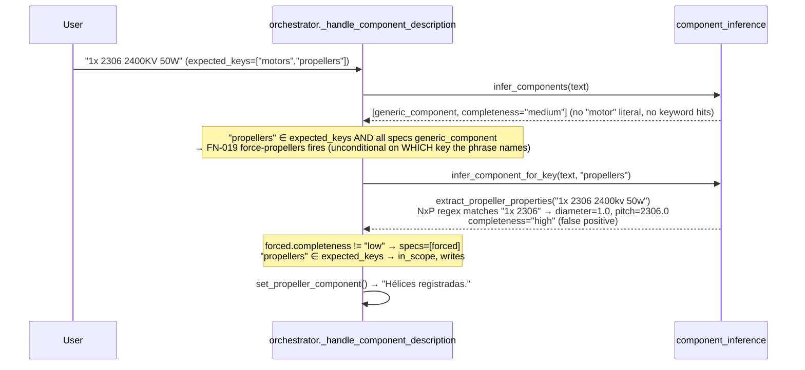
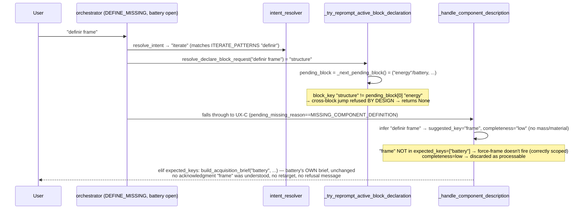
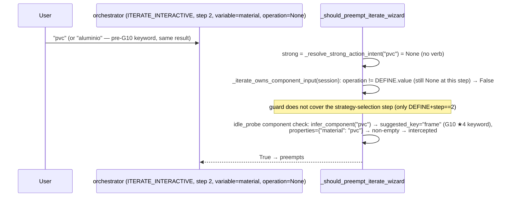

# Investigation — Continuity Hardening (System-Map–first)

**Type:** Investigation only. Zero product `src/`/`library/` changes.
**Contract:** [implementation_contract_continuity_hardening_investigation.md](implementation_contract_continuity_hardening_investigation.md)
**Companion:** [design_continuity_hardening.md](design_continuity_hardening.md)
**Checkpoint base:** `checkpoint-g3` (`a3b72b8`)

---

## 1. Executive summary

G14/G12/G8/G11 are **one root pattern**, not four unrelated bugs: every force-*/intercept/preempt mechanism in Runtime, Acquisition, and Iterate answers **"does key/intent K appear somewhere in my locally-known candidate set?"** instead of **"is K the specific gap I am currently narrating to the user?"** There is no single Acquisition Target Authority object — `expected_keys` (DEFINE_MISSING component wizard), `pending_param_definitions` (DEFINE_MISSING numeric wizard), and `iteration_draft.variable`+`step` (Iterate) are three independent, uncross-checked "what am I collecting" stores. G15 is two separate bugs: one instance of the same authority gap (no list-motors escape) plus one unrelated messaging bug (unfiltered "max catalog thrust" quoted next to a filtered "0 candidates" result — a genuine self-contradiction, code-confirmed, not a copy typo).

**All five root causes were reproduced against live code** (not inferred from reading alone): G14 via a coverage-matrix-style trace through `infer_component_for_key`, G12 via the exact `_try_reprompt_active_block_declaration` cross-block guard, G15 via `format_no_thrust_candidate_message`'s unfiltered/filtered mismatch and `ParamDefinitionSession.answer`'s "No reconozco" fallback, G11-A/G11-B via two live `RefuseLLM` probes that reproduce the wizard-clearing preempt on natural step-2 answers.

**G10 interaction (evidence-based, not presumed):** G10's frame-keyword expansion (★4) measurably **widened** G11-B's existing surface (6 more bare material words now trigger the component-inference preempt check) — but the same probe run against `"aluminio"` (a pre-G10 frame keyword) proves the underlying bug **predates G10**. G10 did not cause G11; it exposed more of it. No G10 code needs reverting; the fix belongs in the preempt predicate, not in the material vocabulary.

**Recommended design: O2 (Acquisition Target Authority helper), phased**, per §6 below — not a single big-bang fix. Slice 1 alone (bounded, ~2 files) closes G14, the most severe (data-corrupting) finding.

---

## 2. System Map ↔ Continuity failures

### 2.1 Sequence diagrams

**G14 — motors phrase → hélices**



**G12 — `definir frame` while battery wizard sticky**



**G8 — `reducir payload` mid-DEFINE_MISSING**

Cited from `.jes/artifacts/sys_map_004_routing_audit.md` (§2, §3) — no delta found in this cut; same mechanism as G12's terminal branch (see §3.4 below for why they share code, not just symptoms).

**G11-A — `cambiar material` → self-preempt (reproduced live)**

```mermaid
sequenceDiagram
    participant U as User
    participant O as orchestrator (ITERATE_INTERACTIVE, step 2, variable=material)
    participant P as _should_preempt_iterate_wizard
    U->>O: "cambiar a pvc"  (a natural answer to "¿Cómo quieres aplicar el cambio?")
    O->>P: _should_preempt_iterate_wizard(text)
    P->>P: strong = _resolve_strong_action_intent(text) = "iterate" ("cambiar" ∈ ITERATE_PATTERNS)
    Note over P: strong ("iterate") ∈ _ITERATE_PREEMPT_INTENTS → return True IMMEDIATELY<br/>_iterate_owns_component_input(session) is NEVER CONSULTED — bypassed
    P-->>O: True
    O->>O: clear_runtime_session(); re-dispatch as IDLE with garbled objective "a pvc"
    O-->>U: "He cerrado la iteración en curso para atender esta instrucción.<br/>Quieres ajustar a pvc del sistema actual." (wrong: this WAS the answer, not a new request)
```

**G11-B — bare material name mid-strategy-step (reproduced live; predates G10, widened by ★4)**



### 2.2 Finding → C-xxx → authority owner → fix layer

| Finding | Primary C-xxx | Authority owner | Proposed fix layer |
|---|---|---|---|
| G14 | C-090 (`infer_component_for_key`, FN-019 force) — no existing ID covers the *force* mechanism's cross-key ambiguity | Acquisition (`component_inference.py`, `orchestrator._handle_component_description`) | Acquisition (bounded: the two force-* blocks) |
| G12 | C-033 (by-design cross-block refusal) + the same terminal branch C-013/C-038 reach (`_handle_component_description`'s `elif expected_keys:`) | Acquisition | Acquisition (new retarget/refuse policy, shared with G8) |
| G8 | C-040 (caveat already documented, SYS-MAP-004/M-005) | Runtime/Acquisition boundary | Same helper as G12 (one policy, not two) |
| G15 (list-motors) | No C-xxx exists — `ParamDefinitionSession.answer`'s numeric fallback has no analyze/list escape at all | Acquisition (`param_definition_session.py`) | Acquisition (mirror G10 ★8's pattern, different subsystem) |
| G15 (incoherent max) | No C-xxx exists — internal to `motor_catalog_assist.format_no_thrust_candidate_message` | Acquisition | Acquisition (messaging-only, independent of the authority fix) |
| G11-A | C-052 (needs a caveat: unconditional strong-intent short-circuit bypasses the owns-input guard) | Iterate (`orchestrator._should_preempt_iterate_wizard`) | Iterate |
| G11-B | C-052 + C-013 (idle_probe fallback path) | Iterate | Iterate (extend the owns-input guard to the strategy-selection step) |

### 2.3 Map doc fixes recommended vs code fixes

**Doc-only (propose text, do not apply in this cut):**
- `CONNECTIONS.md` C-052 — add a caveat mirroring C-040's shape: *"🟢 CONNECTED, but the strong-intent check (line ~420) is unconditional and runs BEFORE `_iterate_owns_component_input` — a step-2 answer that itself contains an ITERATE_PATTERNS verb (`cambiar`, `definir`, ...) preempts the wizard it is answering. See G11."*
- `03_acquisition/ACQUISITION_MAP.md` "Known issues" — currently lists only G8; add G11, G12, G14, G15 pointers (all owned by this subsystem or its Runtime/Iterate boundary).
- `01_runtime/RUNTIME_MAP.md`'s nested `DEFINE_MISSING_PARAMETERS` pseudocode (lines 45-57) is **stale** relative to the G10 cut already landed on this tree: it does not show the `list_materials` soft-interrupt check or the force-frame branch inside `_handle_component_description`. This predates Continuity Hardening and should be corrected as a small housekeeping item regardless of which option Engineer locks here.
- `CONNECTIONS.md` — G10's own force-frame (★3) and list-materials (★8) additions have no `C-xxx` ID at all yet, the same gap SYS-MAP-004 flagged for `component_sync.py`/`explore_continuity.py`/`catalog_bind.py`. Not this cut's job to fix, flagged for completeness.

**Code fixes (this is what the design in §6 targets):** everything in §2.2's "Proposed fix layer" column.

---

## 3. Per-finding confirmation tables

### 3.1 G14 — motors phrase → hélices

| # | Check | Status | Evidence |
|---|---|---|---|
| A5 | `_handle_component_description` trace for `expected_keys=["motors","propellers"]` + `"1x 2306 2400KV 50W"` | CONFIRMED | `system_architecture_catalog.py:158` — `"propulsion": ["motors", "propellers"]`, both keys pending simultaneously; traced turn-by-turn above (§2.1) |
| A6 | Does force-propellers fire even when motors is the (intended) gap? | CONFIRMED | `orchestrator.py:1753-1758` — the guard is `"propellers" in expected_keys and all(... generic_component ...)`, which is true for a *composite* wizard regardless of which of its member keys the phrase actually names |
| A7 | Confirmation string path for "Hélices registradas" | CONFIRMED | `orchestrator.py:1662` (`_apply_inferred_component_spec`, `suggested_key=="propellers"` branch) → `"Hélices registradas."` |
| A8 | Do propulsion composite wizard tests cover this phrase? | GAP CONFIRMED | `extract_propeller_properties`'s `\b(\d+)\s*x\s*(\d+(?:\.\d+)?)\b` regex has no positive/negative test for a motor-count prefix like `"1x 2306"` — `test_aerial_domain.py` tests real propeller sizes (`"10x4.5"`) and `test_propulsion_composite_wizard_flow.py`/FN-011/013/017 tests exercise the composite wizard but not this exact false-positive phrase |
| A9 | Did G10's force-frame increase risk of symmetric force-propellers over-firing? | REFUTED (checked directly) | `extract_frame_properties` requires a literal `g`/`kg` unit for mass and a `MATERIAL_ALIASES` substring for material — `"1x 2306 2400kv 50w"` matches neither (`"50w"` is not `"50g"`), so a hypothetical force-frame call on this exact string returns `completeness="low"` and would **not** override `specs`. G14's bug is specific to `extract_propeller_properties`'s loose `NxP` regex, not a general force-* hazard G10 introduced |

**Root cause:** `infer_component_for_key`'s force mechanism (FN-019) checks *"is the target key somewhere in expected_keys and did nothing else match"* — it has no way to know the phrase was actually answering a **different** member of a composite expected-key set. `extract_propeller_properties`'s `NxP` regex is loose enough to false-positive on `"<count>x <model-number>"` shaped motor phrases.

### 3.2 G15 — catalog help / list mid-wizard

| # | Check | Status | Evidence |
|---|---|---|---|
| A10 | Why "no motor ≥37.7 N" AND "máximo ~55 N"? | CONFIRMED, root cause is a filter mismatch, not a copy bug | `motor_catalog_assist.py:334-345` (`format_no_thrust_candidate_message`) computes `max_available_n = max(m.max_thrust_n for m in lib.list_motors())` — **every** motor, unfiltered by KV/propeller compatibility — while the "0 candidates" verdict that triggered this message came from `build_motor_catalog_suggestions`'s `find_motors_for_requirements(min_thrust_n=..., kv=kv_hint, prop_inch=prop_inch)` (`motor_catalog_assist.py:206-212`), which **is** KV/prop-filtered. The two numbers answer different questions but are presented as if they answer the same one. |
| A11 | Copy bug or true empty set with misleading max? | CONFIRMED: true empty (filtered) set + misleading (unfiltered) max, both individually correct, jointly misleading | See A10 — no code defect in either individual computation, the defect is presenting them side by side without qualifying which filters applied to which number |
| A12 | Mid-wizard `"que motores tenemos…"` — absorbed how? | CONFIRMED | Traced live: `orchestrator.py`'s DEFINE_MISSING branch (numeric-param reason, e.g. `missing_propulsion_parameters`) runs `resolve_intent` first (checks `project_status`/`list_materials`/`analyze`/`calculate`/`simulate` — G10's new `list_materials` intent (★8) does **not** match `"que motores..."`, only `"que materiales..."`), none match → falls past UX-C (reason isn't `MISSING_COMPONENT_DEFINITION`) → falls past the battery-intent intercept (not battery-shaped) → `param_definition_session.answer(user_input)` → `parse_floats_from_input` finds no digits → `"No reconozco 'que motores tenemos en el catalogo' como valor."` (`param_definition_session.py:588`) — this is the exact string family the CLI transcript paraphrased. |
| A13 | Accepting under-requirement thrust (`15` vs `≥37.7`) — by design or gap? | NEEDS ENGINEER | No numeric gate exists against `thrust_hint`/`derive_physical_requirements` anywhere in `answer()`'s plain-float path (confirmed by absence — grep for `thrust_hint` in `param_definition_session.py` shows it used only for *display* copy, never as a validation bound). This may be intentional (never block a user-declared measured value) or an oversight; the contract's Engineer-preference §6.1.4 asks for *honest messaging*, not a gate, so this report does not recommend adding one — flagged for Engineer to confirm scope. |

**Root cause:** two independent, narrower bugs — a filter-transparency defect in one message-composition function (A10/A11), and a missing deterministic escape hatch analogous to G10 ★8 but for motors, inside a *different* subsystem entry point (`ParamDefinitionSession.answer`, not the orchestrator's intent dispatch) (A12).

### 3.3 G12 / G8 — DEFINE_MISSING absorb & sticky retarget

| # | Check | Status | Evidence |
|---|---|---|---|
| A14 | SYS-MAP-004 G8 mechanism still accurate post-G10? | CONFIRMED, no delta | `orchestrator.py`'s DEFINE_MISSING branch structure (checkpoint order) is unchanged by the G10 cut except for the two additive insertions (`list_materials` soft-interrupt, force-frame) — neither touches the UX-C unconditional-intercept ordering SYS-MAP-004 documented. Checkpoint 10h (UX-C) still returns before checkpoint 18 (C-040) whenever `MISSING_COMPONENT_DEFINITION` is the open reason. |
| A15 | G12 vs G8: same intercept? one design or two? | CONFIRMED: same terminal branch, different trigger shape, recommend ONE design | Both G8 phrases (`"reducir payload"`, `"explora opciones"`) and G12 phrases (`"definir frame"` while battery open) run through `_handle_component_description` and land on the **same** `elif expected_keys:` fallback (`orchestrator.py:1921-1928`) — G8's phrases fail *before* that point (no keyword match at all → generic_component, discarded by the FN-017 B4 guard); G12's phrases fail *at* that point (frame keyword matches, but completeness stays `"low"` since no mass/material follows, and — correctly — `"frame" not in expected_keys=["battery"]` so force-frame doesn't rescue it either). Both reach the identical fallback: silently re-narrate the **active** wizard's own key, never checking whether the user named something else, valid, and different. One shared retarget/refuse policy fixes both — a second, G12-specific design would duplicate this exact branch's fix. |
| A16 | Why is `cancelar` the only reliable recovery? | CONFIRMED | `is_navigation_back_phrase` → `clear_runtime_session()` (`orchestrator.py:773-778`) resets **all** session fields (`mode`, every `pending_*`, `collected_params`) to a fresh `IDLE` state — a full reset. `"definir X"` for a *different* block never reaches any session-mutating code path at all when `X != pending_block[0]` (`_try_reprompt_active_block_declaration` returns `None` at exactly that check, `orchestrator.py:1162-1163`) — so the session is left byte-identical to before the turn, forever, until an explicit full reset. |

**Root cause:** identical to G14's shape — a component/routing decision keyed on local membership (`expected_keys[0]`, `pending_block[0] == block_key`) with **no fallback for "the user named a different, valid target."** `_try_reprompt_active_block_declaration` explicitly documents refusing cross-block jumps as intentional (comment: "no cross-block jump") — but nothing downstream of that refusal picks up the slack; the turn just falls through to the generic brief.

### 3.4 G11 — Iterate preempt

| # | Check | Status | Evidence |
|---|---|---|---|
| A17 | `_should_preempt_iterate_wizard` + `_ITERATE_PREEMPT_INTENTS` exact predicates | CONFIRMED | `orchestrator.py:397-430`. `_ITERATE_PREEMPT_INTENTS = {explore_design_space, apply_exploration_result, calculate, simulate, create_project, define_params, iterate, dismiss_suggestion}` — note `"iterate"` itself is a member. `_resolve_strong_action_intent` returns `"iterate"` for **any** phrase matching the broad `ITERATE_PATTERNS` (`definir|cambiar|modificar|reduce|...`), which is nearly guaranteed for a natural wizard-step answer. |
| A18 | Why do prompt-example-shaped phrases classify as preemptable? | CONFIRMED, reproduced live (§2.1 G11-A) | The check order is: `strong in _ITERATE_PREEMPT_INTENTS` **first** (line 420, returns `True` immediately) — `_iterate_owns_component_input(session)` (the guard specifically built to protect step-2 wizard answers) is only consulted **after**, and never reached once the first check already returned. Live probe: `"cambiar material"` → `"sí"` → `"material"` (now at step 2, `variable="material"`) → `"cambiar a pvc"` → `preempted_iterate=True`, wizard cleared, re-dispatched with garbled `objective="a pvc"`. |
| A19 | G11-B: component intercept / frame keywords vs open iterate material slot | CONFIRMED, reproduced live, root cause is a **guard coverage gap**, not an ordering bug | `_iterate_owns_component_input` only recognizes the wizard as "owning" component-shaped input when `draft.operation == DEFINE.value AND session.step == 2`. The strategy-selection step (`variable` already `"material"`, `operation` still `None`) is **not** covered by this guard. A bare `"pvc"` at that step has no strong-intent match (so the line-420 short-circuit doesn't fire) but **does** now match the frame `ComponentRule` (G10 ★4 added `"pvc"` as a frame keyword) via the `idle_probe`/`_should_intercept_component` fallback (line 430) — which preempts. Reproduced identically with `"aluminio"` (a pre-G10 frame keyword), proving the gap predates G10; G10 only added 6 more trigger words to an existing hole. |
| A20 | Map claim for C-052 — overclaim / underspec? | UNDERSPEC | `CONNECTIONS.md` C-052 states only *"pattern-based preempt check, clears session, re-dispatches as IDLE"* — true, but omits that the pattern check is unconditional relative to the wizard's own answer-ownership guard, which is the entire mechanism of both A18 and A19. |

**Root cause:** `_should_preempt_iterate_wizard`'s two checks (strong-intent, component-inference) are not gated by a single, complete "does the active wizard currently own this kind of input" predicate — the existing `_iterate_owns_component_input` only covers one specific step/operation combination, and is bypassed entirely by the first (strong-intent) check regardless of coverage.

---

## 4. Root-cause synthesis

**One tree, four branches, one independent leaf:**

```text
No single Acquisition/Iterate "Active Target Authority" exists
  │
  ├─ Composite expected-key sets have no "which member does this
  │  phrase actually name" tiebreak         → G14 (force-propellers)
  │
  ├─ No retarget/refuse policy exists for
  │  "definir <different-valid-target>"
  │  mid-wizard — falls to the active
  │  wizard's own generic fallback           → G12, G8 (same code branch)
  │
  ├─ Iterate's "does the wizard already own
  │  this input" guard (a) is bypassed by an
  │  earlier unconditional check, and (b)
  │  doesn't cover every wizard step          → G11-A, G11-B
  │
  └─ No deterministic catalog-list escape
     exists for motors (mirrors G10's
     pre-★8 gap, unfixed for this
     subsystem)                                → G15 (list-motors half)

Independent leaf (no shared symbols with the above):
  Unfiltered "max catalog thrust" quoted next
  to a filtered "0 candidates" result           → G15 (incoherent-max half)
```

Not four unrelated UX nits, per the Engineer's own hypothesis (contract §0) — confirmed structurally, with reproduced evidence for every branch except the two G15 leaves, which stand alone.

---

## 5. Interaction with G10 (evidence-based)

| Question | Answer | Evidence |
|---|---|---|
| Did G10 force-frame (★3) create a G14-shaped false positive? | No | A9 — `extract_frame_properties`'s stricter regexes (mass unit literal, material substring) don't false-match `"1x 2306 2400kv 50w"` |
| Did G10 keyword expansion (★4) widen G11-B's surface? | Yes, measurably | A19 — 6 new frame keywords (pvc/titanio/acero/kevlar/magnesio/plástico) each now independently trigger the same pre-existing preempt gap that `"aluminio"`/`"carbono"` already triggered before G10 |
| Did G10 introduce the G11-B bug itself? | No | Reproduced identically with `"aluminio"`, a keyword that predates G10 entirely |
| Should G10 materials/keywords be weakened to reduce G11-B's surface? | No (per Engineer preference §6.1.6) | The fix belongs in the preempt predicate's guard coverage, not in reducing how many materials the frame wizard can recognize — narrowing G10 would reopen the CLI-verified `plastico`/`pvc` PASS this contract's predecessor cut just closed |

---

## 6. Recommended design option + slice plan

See [design_continuity_hardening.md](design_continuity_hardening.md) for the full comparison. Summary: **O2 (Acquisition Target Authority helper)**, phased as:

1. **Slice 1 — G14 target authority** (bounded, `orchestrator.py` only): the two FN-019-style force-* blocks gain a tiebreak so a composite expected-key set doesn't let one member's loose extractor claim a phrase that plausibly belongs to another.
2. **Slice 2 — G12/G8 retarget policy**: one shared helper, consulted at the top of `_handle_component_description` and reused for the engineering-intent gate, implementing Engineer preference §6.1.2's (a)/(b) choice (★ to lock).
3. **Slice 3 — G15**: messaging fix (filtered max) + list-motors escape mirroring G10 ★8, scoped to `ParamDefinitionSession`.
4. **Slice 4 — G11 answer-vs-intent**: extend/reorder the iterate preempt guard so a wizard step's own answer-shape wins before the generic strong-intent/component-inference checks.

Each slice is independently shippable and testable; Slice 1 alone already closes the single highest-severity (silent data corruption) finding.

---

## 7. Open questions for Engineer

1. **G12 retarget vs refuse (Engineer preference §6.1.2, a/b)** — should `"definir frame"` mid-battery-wizard *retarget* (clear battery's `collected_params`, honestly, and open frame) or *refuse* with a one-line "cancelar primero"? Both are listed as acceptable in the contract; this report takes no position (needs ★ lock — see design doc).
2. **G11 fix shape (Slice 4)** — reorder `_should_preempt_iterate_wizard`'s checks (owns-input first) vs. extend `_iterate_owns_component_input`'s step coverage vs. narrow `_ITERATE_PREEMPT_INTENTS`? All three close the reproduced bug; they have different blast radii (see design doc §4).
3. **G15 thrust gate (A13)** — add a validation bound against `thrust_hint`, or messaging-only? This report recommends messaging-only per the contract's own Engineer-preference wording but flags it as a real open call, not a foregone conclusion.
4. **Scope confirmation** — this bundle (G14/G12/G8/G11/G15) is proposed as 4 slices of one Implementation Contract, or should G15 (which shares no code with the other three) be split into its own, smaller, faster contract? Either is consistent with the investigation; the design doc defaults to "one contract, four slices" per the Engineer's own phased-implementation preference, but flags the split as a cheap alternative if faster CLI validation of G14 alone is wanted first.
