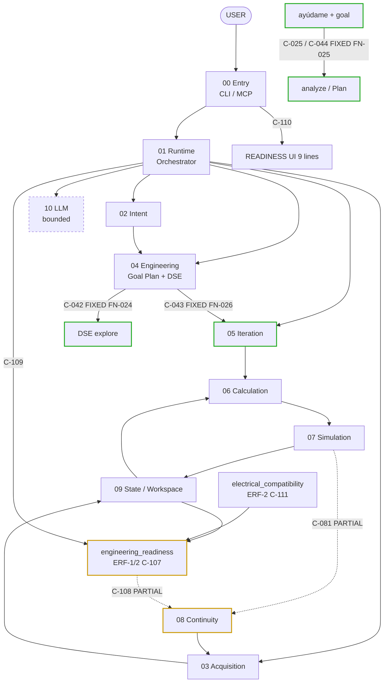

# Jarvis System Map — Diagrams

**Version:** SYS-MAP-002 visual companion  
**Date:** 2026-08-10 (ERF-1 delta: 2026-08-18; ERF-2 delta: 2026-08-19)  
**Canonical edge truth:** [`CONNECTIONS.md`](CONNECTIONS.md) → **Canonical registry** = **65** unique `C-xxx` (IDs sparse through C-112). Updated 2026-08-10 by FN-024 (C-042 fixed, C-105/C-106 added); updated 2026-08-12 by FN-025 (C-025/C-044 fixed) and FN-026 (C-043 fixed); updated 2026-08-18 by ERF-1 (C-107–C-110 added); updated 2026-08-19 by ERF-2 (C-111–C-112 added, C-107/C-110 updated).

Interactive Cursor canvas (filterable graph + full table): [`jarvis-system-map.canvas.tsx`](jarvis-system-map.canvas.tsx).  
To open beside chat in Cursor, sync that file into the project `canvases/` folder (see header comment in the `.tsx`).

## Counts (do not conflate)

```text
CONNECTIONS.md
│
├── Canonical registry     → 65 C-xxx únicos
├── Derived/detail views   → may repeat C-xxx (do not add to 63)
└── Forbidden transitions  → 10 (not C-xxx)
```

| Set | Count | Notes |
|---|---:|---|
| Registry edges (canonical) | **65** | Only count this |
| Connected 🟢 | **63** | of 65 (C-032 ⛔ removed) |
| Broken 🔴 | **0** | — |
| Partial 🟡 | **2** | C-081, C-108 |
| Forbidden transitions | **+10** | Not registry edges |
| File table cells `\| C-xxx \|` | — | Do not sum leading cells across the whole file — see `CONNECTIONS.md`'s "Document structure" note |

**FN-024 (2026-08-10):** C-042 fixed (🔴→🟢, Handoff Context bind); C-105/C-106 added.

**FN-025 (2026-08-12):** C-025/C-044 fixed (🔴→🟢, help+goal → same Goal Plan path). Same user failure listed under Intent and Engineering (counted once).

**FN-026 (2026-08-12):** C-043 fixed (🔴→🟢, Goal Plan lever → Iterate preseed, via `handoff_matching.match_plan_lever`). **H1–H4 all closed, 0 RED remaining.**

**ERF-1 (2026-08-18):** C-107–C-110 added (`engineering_readiness` aggregator + startup/CLI surface). C-108 🟡 PARTIAL — Continuity consumes readiness for catalog-gap ranking only (Slice 4b deferred). Two forbidden absences added (Continuity→Readiness; persist `readiness.json`).

**ERF-2 (2026-08-19):** C-111–C-112 added (`electrical_compatibility` pure checks → readiness gap generation; ESC acquisition routing). C-107 updated (9 subsystems, +`electronics`). C-110 updated (9 readiness lines). `INCOMPATIBLE` verdicts with ★3 gate. Tag `checkpoint-erf2` (`9af0cc9`).

**Project Closure (2026-08-31):** IC 1–3 doc sync — C-030 expanded (motor/propeller/battery catalog pick); C-082/C-107 detail updated (`sku_resolved` propeller branch display-only; `requirements_declared` explicit-none). **No new C-xxx.** Tags: `checkpoint-requirements-closure` → `checkpoint-battery-catalog-bind-ux` → `checkpoint-closure-policy` (`8728a85`). As-is sync: `ARCHITECTURE.md`, `system_map/*`. Product contract: `ENGINEERING_READINESS_VISION.md` §11.

**Motor OP Voltage Coherence (2026-09-01):** MOP-1…MOP-4 doc sync — `library.resolve_operating_point` requires explicit voltage for exact match; `component_writers` stores `propulsion_resolution.voltage_validated` / conditional battery-bind re-resolve; `DesignExplorer.explore` baseline uses live `current_parameters`; explore message honesty when OP unvalidated. **No new C-xxx.** Tag: `checkpoint-motor-op-voltage-coherence` (`a563fe7` / `v0.3.4`). Detail: C-030 mutation note, C-091/`09_state`, `04_engineering`. Probe hygiene: `cli_probe_impl_d_sku_bom.py` G24D step 3 (`0db2d2b`).

Canvas / this file manually mirror the registry (known drift risk). When adding a connection: update Canonical registry first, then Detail, then DIAGRAMS + canvas.

---

## Level 0 — whole system



---

## Fixed / partial (headline)

| ID | From | To | Status |
|---|---|---|---|
| C-042 | Goal Plan CTA (`explora opciones`) | DSE goal binding | 🟢 FIXED (FN-024, 2026-08-10) |
| C-025 / C-044 | `ayúdame` + named goal | Plan / Explore | 🟢 FIXED (FN-025, 2026-08-12) |
| C-043 | Goal Plan lever (e.g. `safety_factor`) | Iterate wizard preseed | 🟢 FIXED (FN-026, 2026-08-12) |
| C-081 | Sim `safety_margin_ratio` | Continuity `next_useful_step` | 🟡 PARTIAL — H5, deferred |
| C-108 | `EngineeringReadinessResult` | Continuity catalog-gap ranking | 🟡 PARTIAL — ERF-1 Slice 4b deferred |

---

## Registry by band (all 63)

Detail and evidence stay in `CONNECTIONS.md`. This index is for scanning.

### 00 Entry
| ID | From → To | Status |
|---|---|---|
| C-001 | User → CLI adapter | 🟢 |
| C-002 | CLI/MCP → `handle_user_text` | 🟢 |
| C-003 | CLI/MCP structured → `orchestrator.handle` | 🟢 |

### 01 Runtime
| ID | From → To | Status |
|---|---|---|
| C-010 | Runtime → Global commands | 🟢 |
| C-011 | Runtime → FN-004 structural-confirm | 🟢 |
| C-012 | Runtime → Bug 54 pending_define | 🟢 |
| C-013 | Runtime → Global component intercept | 🟢 |
| C-014 | Runtime → Mode-branch dispatch | 🟢 |
| C-015 | Runtime → Parameter ingestion | 🟢 |
| C-016 | `handle` → ActionRouter → Action.run | 🟢 |

### 02 Intent
| ID | From → To | Status |
|---|---|---|
| C-020 | Runtime → IntentResolver | 🟢 |
| C-021 | Intent `project_status` → `_handle_project_status` | 🟢 |
| C-022 | Intent `analyze` → `_handle_analyze` | 🟢 |
| C-023 | Intent `define_params` → define-missing bridge | 🟢 |
| C-024 | Intent `dismiss` → `_handle_dismiss_suggestion` | 🟢 |
| C-025 | `ayúdame` + goal → engineering_intent | 🟢 (FN-025) |

### 03 Acquisition
| ID | From → To | Status |
|---|---|---|
| C-030 | Runtime IDLE → FN-005 motor help | 🟢 |
| C-031 | Runtime IDLE → FN-014 acquisition wizard | 🟢 |
| C-032 | ~~Runtime IDLE → FN-015 pending-help~~ REMOVED (G23) | ⛔ |
| C-033 | DEFINE_MISSING → FN-013 reprompt | 🟢 |
| C-034 | DEFINE_MISSING → FN-016 nav/cancel | 🟢 |
| C-035 | Intent FN-023 phrasing → Continuity status | 🟢 |
| C-036 | Continuity → Acquisition `_next_pending_block` | 🟢 |
| C-037 | Acquisition complete → `_set_pending_next_block` | 🟢 |
| C-038 | Acquisition open → `acquisition_brief` | 🟢 |

### 04 Engineering
| ID | From → To | Status |
|---|---|---|
| C-040 | Intent iterate/unknown → engineering_intent | 🟢 |
| C-041 | engineering_intent → `format_goal_plan` | 🟢 |
| C-042 | Goal Plan CTA → DSE binding | 🟢 (FN-024) |
| C-043 | Goal Plan lever → Iterate preseed | 🟢 (FN-026, H4) |
| C-044 | `ayúdame` + goal → Plan/Explore | 🟢 (FN-025) |
| C-045 | Intent explore → DesignExplorer | 🟢 |
| C-046 | explore result → apply_exploration | 🟢 |
| C-105 | engineering_intent success → create/replace `handoff_context` | 🟢 (FN-024, new) |
| C-106 | active `handoff_context` → `_handle_explore` goal bind | 🟢 (FN-024, new) |

### 05 Iteration
| ID | From → To | Status |
|---|---|---|
| C-050 | `handle` ITERATE → IterateInteractiveSession | 🟢 |
| C-051 | ITERATE → Bug 7 soft-interrupt | 🟢 |
| C-052 | ITERATE → Calibration preempt | 🟢 |
| C-053 | Iterate.answer → semantic_interpreter | 🟢 |
| C-054 | Iterate confirm → MutationEngine | 🟢 |

### 06/07 Calc · Sim
| ID | From → To | Status |
|---|---|---|
| C-060 | `current_parameters` → CalculationEngine | 🟢 |
| C-061 | component_resolver → Calculation override | 🟢 |
| C-070 | CalculationBundle → FeasibilitySimulator | 🟢 |
| C-071 | SimulationResult → StateManager / latest_results | 🟢 |

### 08 Continuity
| ID | From → To | Status |
|---|---|---|
| C-080 | ProjectState+BOM+req → Continuity | 🟢 |
| C-081 | Sim margin → Continuity next_useful_step | 🟡 |
| C-082 | classify_component → BOM | 🟢 |
| C-083 | classify_component → `_block_progress_status` | 🟢 |
| C-084 | ProjectState → PhaseLayer | 🟢 |
| C-085 | Context → ReasoningLayer | 🟢 |
| C-107 | ProjectState + authorities → `build_engineering_readiness` (9 subsystems) | 🟢 (ERF-1, updated ERF-2) |
| C-108 | Readiness → Continuity catalog-gap ranking | 🟡 (ERF-1) |
| C-109 | `build_startup_context` → `"readiness"` field | 🟢 (ERF-1) |
| C-110 | CLI → `ENGINEERING READINESS` block (9 lines) | 🟢 (ERF-1, updated ERF-2) |
| C-111 | `electrical_compatibility` → readiness gap generation | 🟢 (ERF-2) |
| C-112 | ESC acquisition routing (out-of-scope explicit save) | 🟢 (ERF-2, FN-ESC) |

### 09 Components / State
| ID | From → To | Status |
|---|---|---|
| C-090 | Free text → component_inference | 🟢 |
| C-091 | ComponentSpec → component_writers | 🟢 |
| C-092 | Orchestrator checkpoint → runtime session | 🟢 |
| C-093 | ProjectState → `state.json` | 🟢 |
| C-094 | ProjectState → MD views | 🟢 |

### 10 LLM
| ID | From → To | Status |
|---|---|---|
| C-100 | orchestrator → llm interpret | 🟢 |
| C-101 | PromptBuilder → LLMClient | 🟢 |
| C-102 | Raw LLM → ActionPolicy parse/validate | 🟢 |
| C-103 | Validated action_request → `orchestrator.handle` | 🟢 |
| C-104 | orchestrator → llm analyze (narration) | 🟢 |

---

## Forbidden transitions (10 — not registry edges)

```text
LLM → acquisition target
LLM → goal selection
LLM → DSE configuration choice
Continuity → mutate ProjectState
Continuity → engineering_readiness          (ERF-1 — circularity forbidden)
engineering_readiness → persist readiness.json   (ERF-1 — derived on read)
DSE → silent mutate without apply
Goal Planner → write physical params
Component Inference → write components directly
Analyze (LLM) → choose next gap
```

All structurally absent today (desired). Full wording: `CONNECTIONS.md` + `AUTHORITY.md`.

---

## Maintenance

When an FN creates or repairs a `C-xxx`:

1. Update status in `CONNECTIONS.md`
2. Update `MISMATCHES.md` if applicable
3. Update this file’s rollup / band table
4. Update `jarvis-system-map.canvas.tsx` (and re-sync the live Cursor canvas if used)
